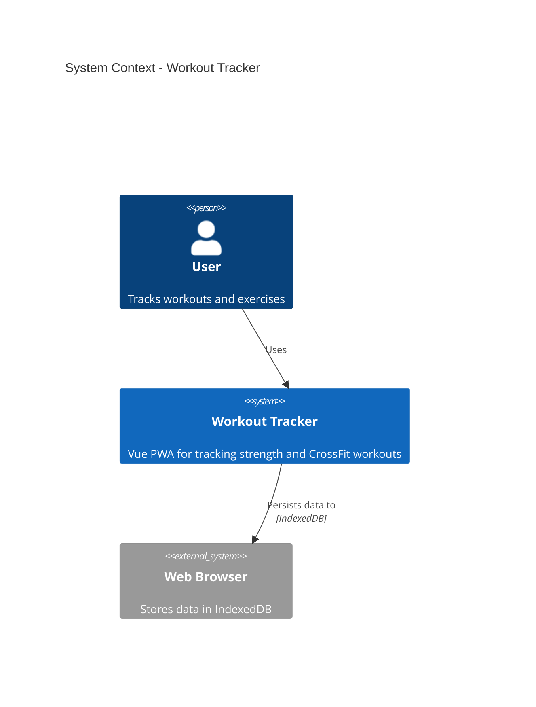
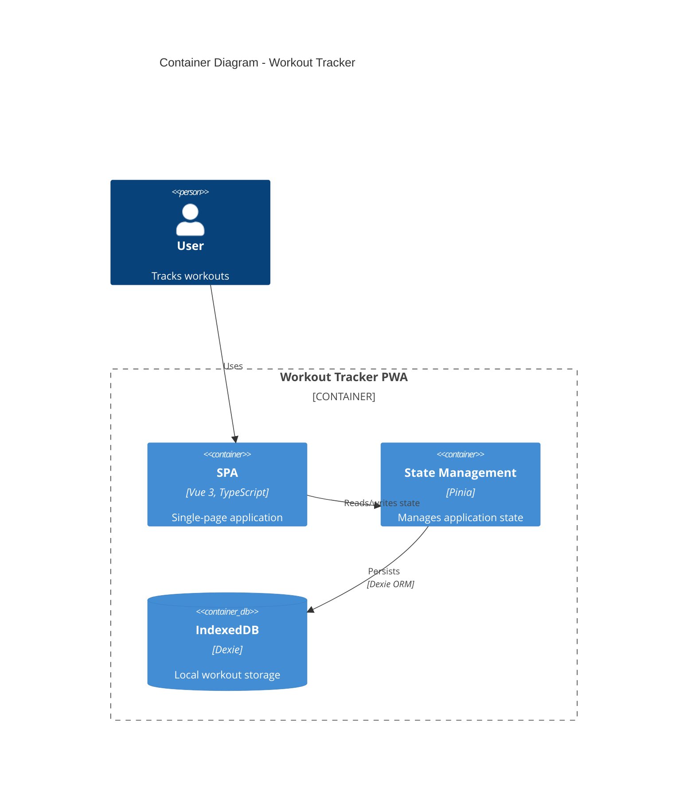
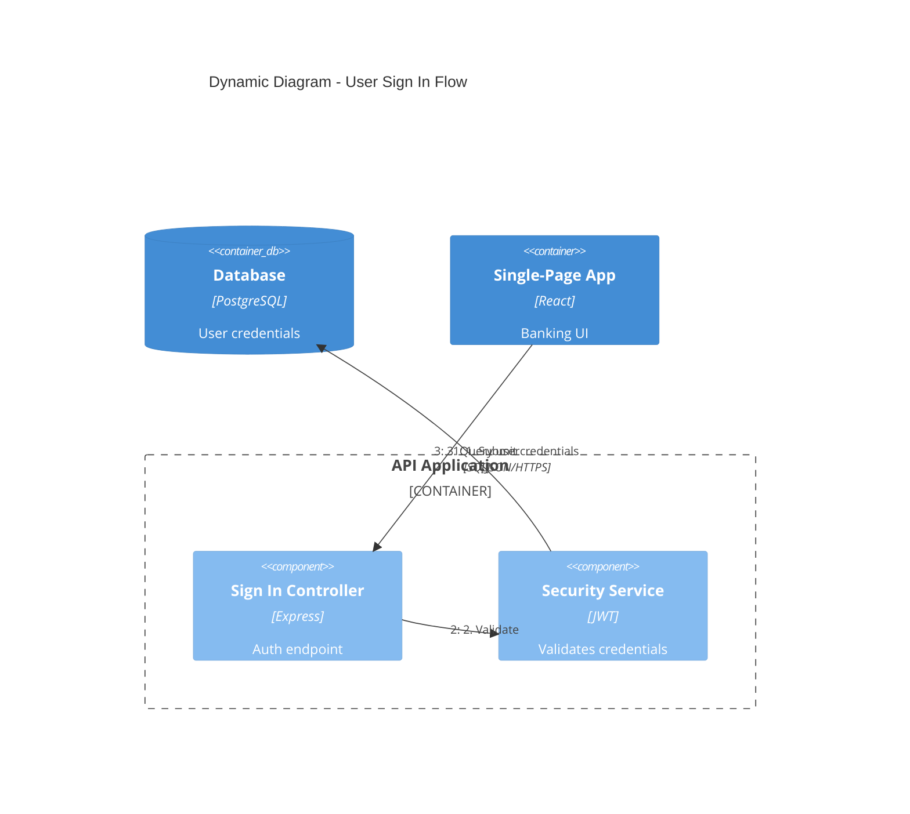
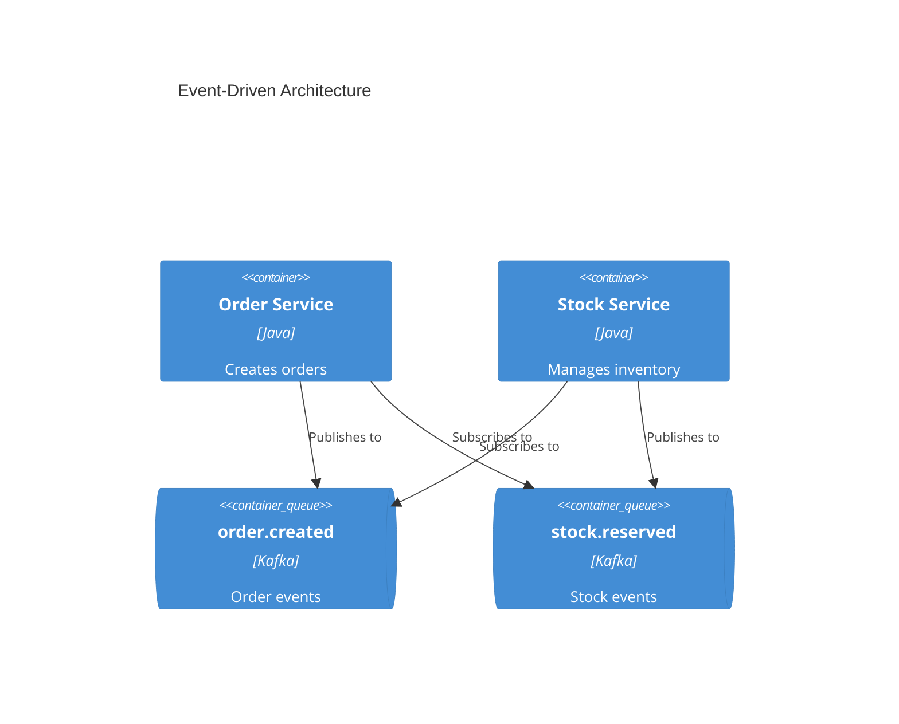

# C4 Architecture Documentation

Generate software architecture documentation using C4 model diagrams in Mermaid syntax.

## Workflow

1. **Understand scope** - Determine which C4 level(s) are needed based on audience
2. **Analyze codebase** - Explore the system to identify components, containers, and relationships
3. **Generate diagrams** - Create Mermaid C4 diagrams at appropriate abstraction levels
4. **Document** - Write diagrams to markdown files with explanatory context

## C4 Diagram Levels

| Level | Diagram Type | Audience | Shows | When to Create |
|-------|-------------|----------|-------|----------------|
| 1 | **C4Context** | Everyone | System + external actors | Always (required) |
| 2 | **C4Container** | Technical | Apps, databases, services | Always (required) |
| 3 | **C4Component** | Developers | Internal components | Only if adds value |
| 4 | **C4Deployment** | DevOps | Infrastructure nodes | For production systems |
| - | **C4Dynamic** | Technical | Request flows (numbered) | For complex workflows |

**Key Insight:** "Context + Container diagrams are sufficient for most software development teams."

## Quick Start Examples

### System Context (Level 1)


### Container Diagram (Level 2)


### Dynamic Diagram (Request Flow)


## Element Syntax

### People and Systems
```
Person(alias, "Label", "Description")
Person_Ext(alias, "Label", "Description")
System(alias, "Label", "Description")
System_Ext(alias, "Label", "Description")
SystemDb(alias, "Label", "Description")
SystemQueue(alias, "Label", "Description")
```

### Containers
```
Container(alias, "Label", "Technology", "Description")
ContainerDb(alias, "Label", "Technology", "Description")
ContainerQueue(alias, "Label", "Technology", "Description")
```

### Components
```
Component(alias, "Label", "Technology", "Description")
ComponentDb(alias, "Label", "Technology", "Description")
```

### Boundaries
```
Enterprise_Boundary(alias, "Label") { ... }
System_Boundary(alias, "Label") { ... }
Container_Boundary(alias, "Label") { ... }
```

### Relationships
```
Rel(from, to, "Label")
Rel(from, to, "Label", "Technology")
BiRel(from, to, "Label")
Rel_U(from, to, "Label")  # Upward
Rel_D(from, to, "Label")  # Downward
Rel_L(from, to, "Label")  # Leftward
Rel_R(from, to, "Label")  # Rightward
```

## Best Practices

1. **Every element must have**: Name, Type, Technology (where applicable), and Description
2. **Use unidirectional arrows only** - Bidirectional arrows create ambiguity
3. **Label arrows with action verbs** - "Sends email using", "Reads from"
4. **Include technology labels** - "JSON/HTTPS", "JDBC", "gRPC"
5. **Stay under 20 elements per diagram**
6. **Start at Level 1** - Context diagrams help frame the system scope
7. **Always include a title**

## Microservices Guidelines

### Single Team Ownership
Model each microservice as a **container**.

### Multi-Team Ownership
Promote microservices to **software systems** when owned by separate teams.

### Event-Driven Architecture
Show individual topics/queues as containers, NOT a single "Kafka" box:


## Output Location

Write architecture documentation to `docs/architecture/`:
- `c4-context.md` - System context diagram
- `c4-containers.md` - Container diagram
- `c4-components-{feature}.md` - Component diagrams per feature
- `c4-deployment.md` - Deployment diagram
- `c4-dynamic-{flow}.md` - Dynamic diagrams for specific flows

## Audience-Appropriate Detail

| Audience | Recommended Diagrams |
|----------|---------------------|
| Executives | System Context only |
| Product Managers | Context + Container |
| Architects | Context + Container + key Components |
| Developers | All levels as needed |
| DevOps | Container + Deployment |

## References

- [C4 Syntax Reference](.claude/skills/c4-architecture/references/c4-syntax.md)
- [Common Mistakes](.claude/skills/c4-architecture/references/common-mistakes.md)
- [Advanced Patterns](.claude/skills/c4-architecture/references/advanced-patterns.md)
