# Advanced C4 Architecture Patterns

Reusable C4 patterns for common architectural styles, each with a complete Mermaid C4 diagram example.

---

## Table of Contents

1. [Microservices Architecture](#1-microservices-architecture)
2. [Event-Driven Architecture](#2-event-driven-architecture)
3. [API Gateway Pattern](#3-api-gateway-pattern)
4. [Database per Service Pattern](#4-database-per-service-pattern)
5. [CQRS / Event Sourcing Pattern](#5-cqrs--event-sourcing-pattern)
6. [Multi-Region Deployment](#6-multi-region-deployment)
7. [CI/CD Pipeline Visualization](#7-cicd-pipeline-visualization)
8. [Cross-Cutting Concerns](#8-cross-cutting-concerns)
9. [Backend for Frontend (BFF) Pattern](#9-backend-for-frontend-bff-pattern)
10. [Saga / Choreography Pattern](#10-saga--choreography-pattern)

---

## 1. Microservices Architecture

A system decomposed into independently deployable services, each owning its own data and communicating through well-defined APIs or messaging.

### Context Diagram

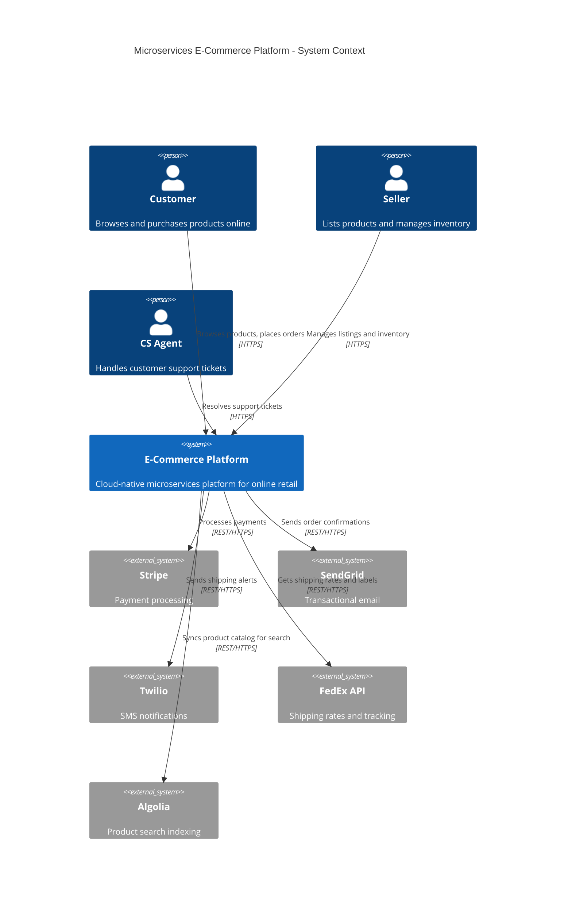

### Container Diagram

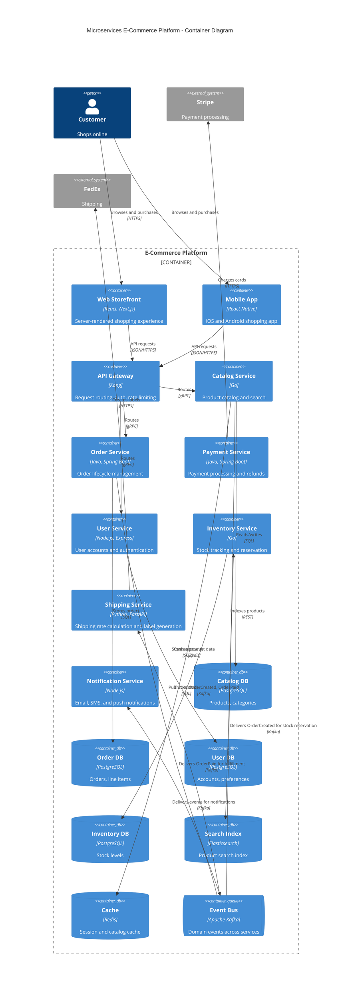

### Key Characteristics

- Each service owns its own database (no shared databases)
- Services communicate via API Gateway (synchronous) and Event Bus (asynchronous)
- Independent deployment and scaling per service
- Technology diversity allowed (Go, Java, Node.js, Python)

---

## 2. Event-Driven Architecture

An architecture where components communicate primarily through events, enabling loose coupling, high scalability, and real-time responsiveness.

### Container Diagram

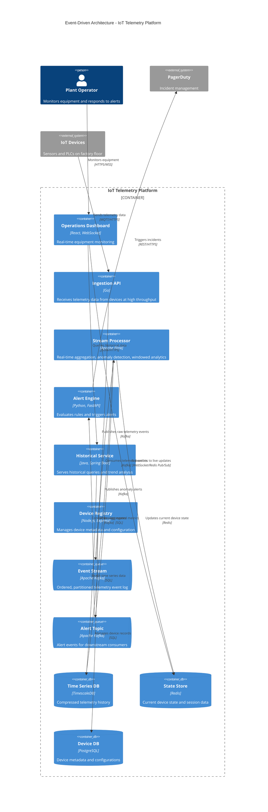

### Key Characteristics

- Events as the primary communication mechanism
- Stream processing for real-time analytics and anomaly detection
- Event log (Kafka) as the system of record for raw data
- Multiple consumers can independently process the same event stream
- Separation of real-time (stream) and historical (batch) query paths

---

## 3. API Gateway Pattern

A centralized entry point that handles cross-cutting concerns like authentication, rate limiting, request routing, and protocol translation.

### Container Diagram

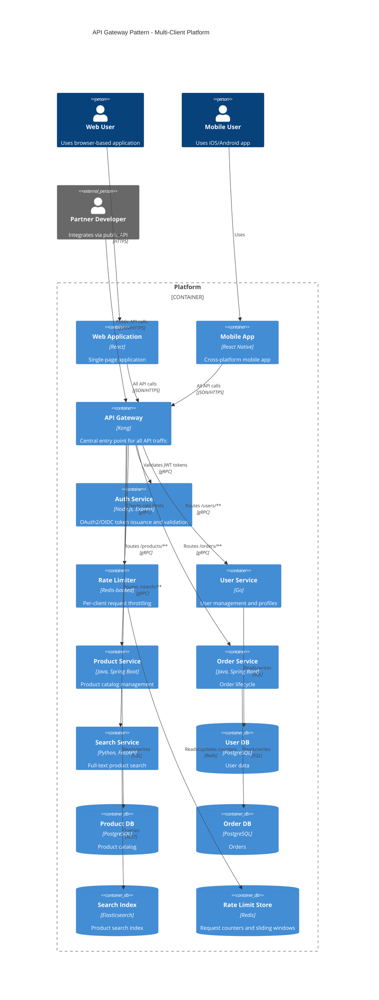

### Dynamic Diagram - Request Flow Through Gateway

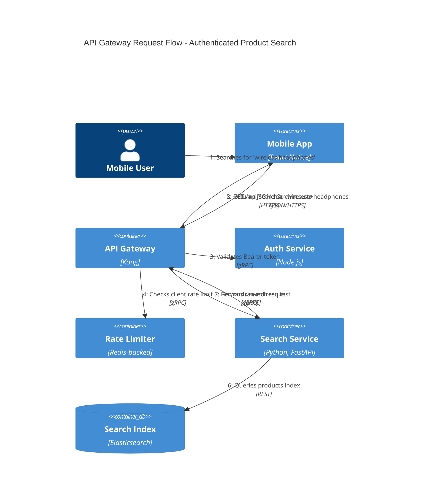

### Key Characteristics

- Single entry point for all clients (web, mobile, third-party)
- Authentication and authorization enforced at the gateway
- Rate limiting protects backend services from abuse
- Protocol translation (HTTPS to gRPC) at the gateway
- Backend services are not directly exposed to the internet

---

## 4. Database per Service Pattern

Each microservice owns its private database, ensuring data encapsulation and independent schema evolution. Services share data through APIs and events, never through direct database access.

### Container Diagram

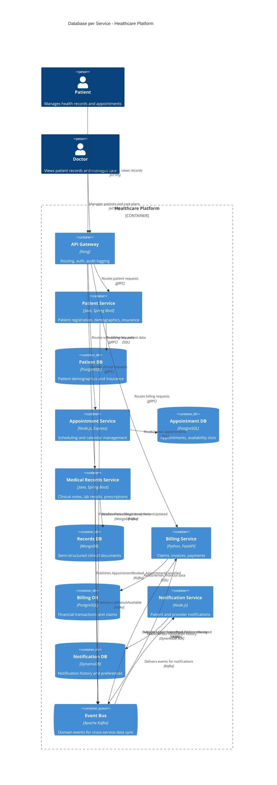

### Key Characteristics

- Each service has its own private database -- no other service accesses it directly
- Polyglot persistence: PostgreSQL for relational data, MongoDB for documents, DynamoDB for key-value
- Data consistency across services is eventual, achieved through domain events
- Schema changes in one service do not impact other services
- The event bus enables data synchronization without tight coupling

---

## 5. CQRS / Event Sourcing Pattern

Command Query Responsibility Segregation separates read and write models. Event Sourcing persists state as an append-only log of domain events rather than mutable rows.

### Container Diagram

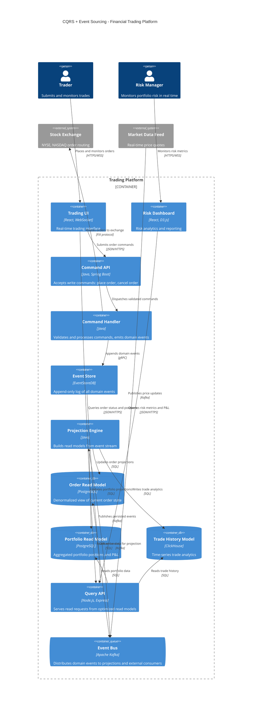

### Key Characteristics

- **Command side:** Validates business rules, emits events, writes to event store
- **Query side:** Multiple denormalized read models optimized for specific queries
- **Event Store:** The single source of truth -- an append-only log of all state changes
- **Projections:** Rebuild read models by replaying events from the event store
- **Separate scaling:** Read and write sides scale independently
- **Audit trail:** Complete history of every state change, useful for financial compliance

---

## 6. Multi-Region Deployment

Deploying the same system across multiple geographic regions for latency reduction, disaster recovery, and data sovereignty compliance.

### Deployment Diagram

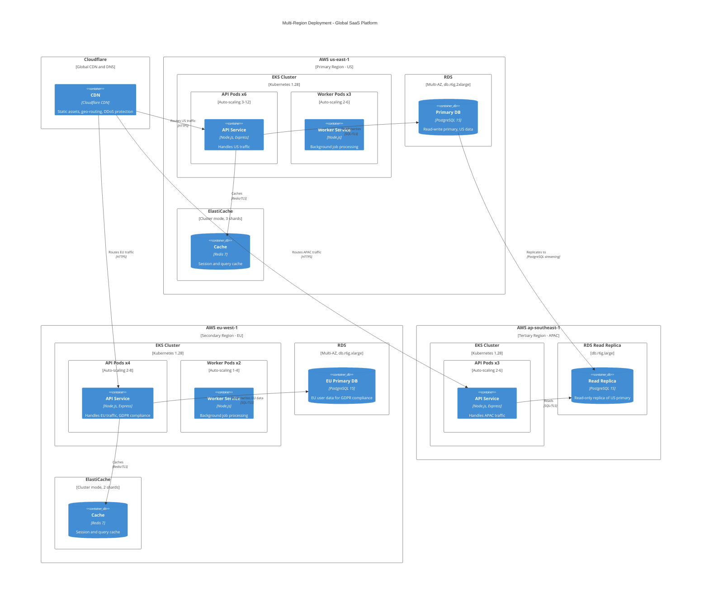

### Key Characteristics

- **Geo-routing** at the CDN/DNS layer directs traffic to the nearest region
- **Data sovereignty:** EU data stays in the EU region for GDPR compliance
- **Read replicas** in secondary regions reduce read latency
- **Active-active** in US and EU; **read-only** in APAC
- **Independent scaling** per region based on traffic patterns
- **Failover:** CDN can redirect traffic if a region goes down

---

## 7. CI/CD Pipeline Visualization

Visualizing the continuous integration and deployment pipeline as a C4 Context or Container diagram to show how code flows from commit to production.

### Context Diagram

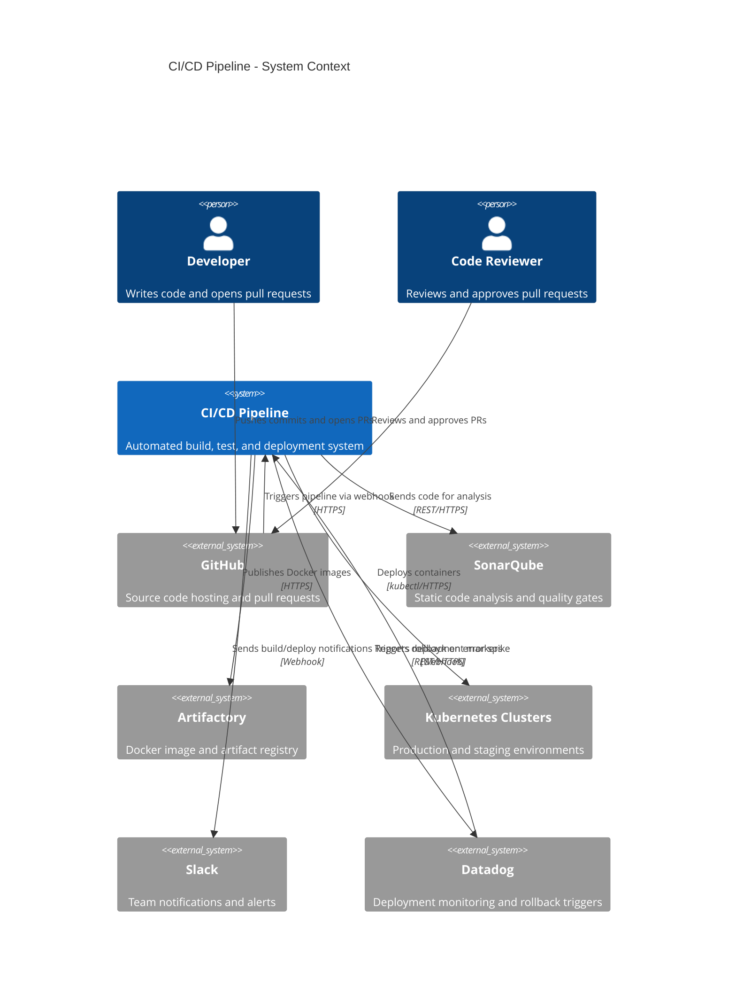

### Container Diagram

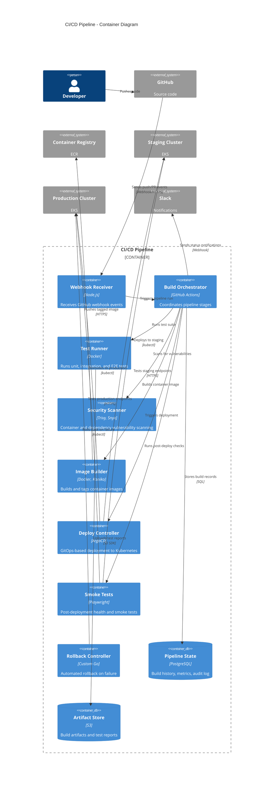

### Key Characteristics

- **Pipeline as code:** Pipeline definition lives in the repository
- **Security scanning** as a mandatory pipeline stage (shift-left security)
- **Progressive deployment:** Staging validation before production
- **Automated rollback** on post-deployment failure
- **Audit trail** of all builds, tests, and deployments
- **GitOps:** Desired state in Git, ArgoCD reconciles the cluster

---

## 8. Cross-Cutting Concerns

Patterns for handling concerns that span multiple services: authentication, authorization, logging, monitoring, tracing, and service mesh.

### Container Diagram

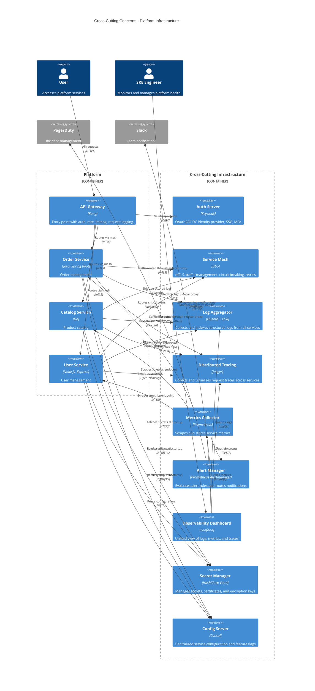

### Key Characteristics

- **Authentication/Authorization:** Centralized at the API Gateway and Auth Server; services trust validated tokens
- **Service Mesh:** mTLS between all services, circuit breaking, retries, traffic splitting
- **Observability triad:** Logs (Loki), Metrics (Prometheus), Traces (Jaeger) unified in Grafana
- **Secret management:** No hardcoded secrets; Vault provides dynamic secrets and certificate rotation
- **Configuration management:** Centralized config with Consul; feature flags for progressive rollouts
- **Alerting chain:** Prometheus rules trigger Alertmanager which routes to PagerDuty/Slack based on severity

---

## 9. Backend for Frontend (BFF) Pattern

A dedicated backend service tailored to each frontend client, aggregating and transforming data from multiple downstream services.

### Container Diagram

```mermaid
C4Container
    title Backend for Frontend (BFF) Pattern - Media Streaming Platform

    Person(webUser, "Web User", "Streams content in browser")
    Person(mobileUser, "Mobile User", "Streams on phone/tablet")
    Person(tvUser, "Smart TV User", "Streams on television")

    Container_Boundary(platform, "Streaming Platform") {
        Container(webApp, "Web Application", "React", "Feature-rich browsing and playback")
        Container(mobileApp, "Mobile App", "React Native", "Optimized for mobile data and battery")
        Container(tvApp, "TV App", "Android TV SDK", "10-foot UI, remote-control navigation")

        Container(webBff, "Web BFF", "Node.js, Express", "Aggregates data for web client: full catalog, social features, recommendations")
        Container(mobileBff, "Mobile BFF", "Node.js, Express", "Optimized payloads for mobile: compressed images, offline support, reduced data")
        Container(tvBff, "TV BFF", "Node.js, Express", "Simplified data for TV: large artwork, curated rows, minimal navigation depth")

        Container(catalogService, "Catalog Service", "Java, Spring Boot", "Content metadata, genres, ratings")
        Container(streamingService, "Streaming Service", "Go", "Adaptive bitrate video delivery")
        Container(recommendationService, "Recommendation Service", "Python, FastAPI", "ML-powered personalized recommendations")
        Container(userService, "User Service", "Node.js, Express", "Profiles, watchlists, preferences")
        Container(socialService, "Social Service", "Node.js, Express", "Reviews, ratings, friend activity")

        ContainerDb(catalogDb, "Catalog DB", "PostgreSQL", "Content metadata")
        ContainerDb(userDb, "User DB", "PostgreSQL", "User profiles and preferences")
        ContainerDb(recommendationCache, "Recommendation Cache", "Redis", "Pre-computed recommendations")
    }

    System_Ext(cdnProvider, "CDN", "CloudFront - Video segment delivery")

    Rel(webUser, webApp, "Browses and streams", "HTTPS")
    Rel(mobileUser, mobileApp, "Browses and streams")
    Rel(tvUser, tvApp, "Browses and streams")

    Rel(webApp, webBff, "API requests", "JSON/HTTPS")
    Rel(mobileApp, mobileBff, "API requests", "JSON/HTTPS")
    Rel(tvApp, tvBff, "API requests", "JSON/HTTPS")

    Rel(webBff, catalogService, "Fetches full catalog data", "gRPC")
    Rel(webBff, recommendationService, "Gets personalized lists", "gRPC")
    Rel(webBff, userService, "Gets user profile", "gRPC")
    Rel(webBff, socialService, "Gets friend activity and reviews", "gRPC")

    Rel(mobileBff, catalogService, "Fetches condensed catalog data", "gRPC")
    Rel(mobileBff, recommendationService, "Gets top-N recommendations", "gRPC")
    Rel(mobileBff, userService, "Gets user profile", "gRPC")

    Rel(tvBff, catalogService, "Fetches curated catalog rows", "gRPC")
    Rel(tvBff, recommendationService, "Gets featured recommendations", "gRPC")

    Rel(catalogService, catalogDb, "Reads metadata", "SQL")
    Rel(userService, userDb, "Reads/writes profiles", "SQL")
    Rel(recommendationService, recommendationCache, "Reads cached recommendations", "Redis")
    Rel(streamingService, cdnProvider, "Serves video segments via", "HTTPS")
```

### Key Characteristics

- **One BFF per client type:** Web, Mobile, and TV each have a dedicated backend
- **Tailored responses:** Mobile BFF sends compressed images and smaller payloads; TV BFF sends large artwork and simplified navigation
- **Aggregation layer:** BFFs combine data from multiple downstream services into client-optimal responses
- **Independent evolution:** Web BFF can add social features without affecting mobile or TV clients
- **Downstream services remain generic:** Catalog, User, and Recommendation services serve all BFFs with the same API

---

## 10. Saga / Choreography Pattern

Managing distributed transactions across multiple services using a choreography-based saga where each service reacts to events and publishes its own events, with compensating actions for failure scenarios.

### Container Diagram

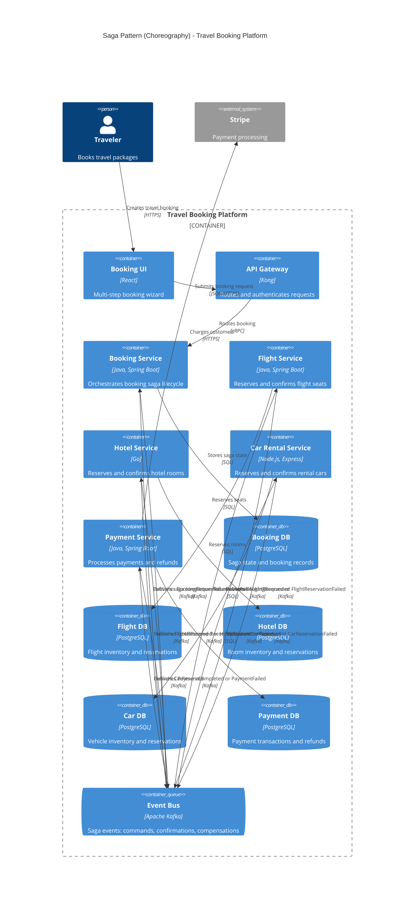

### Dynamic Diagram - Happy Path

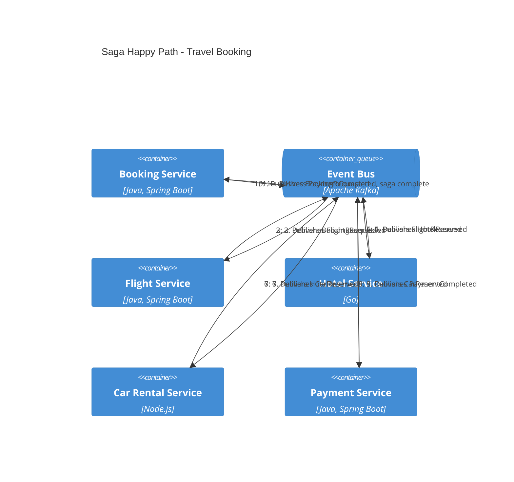

### Dynamic Diagram - Compensation Path

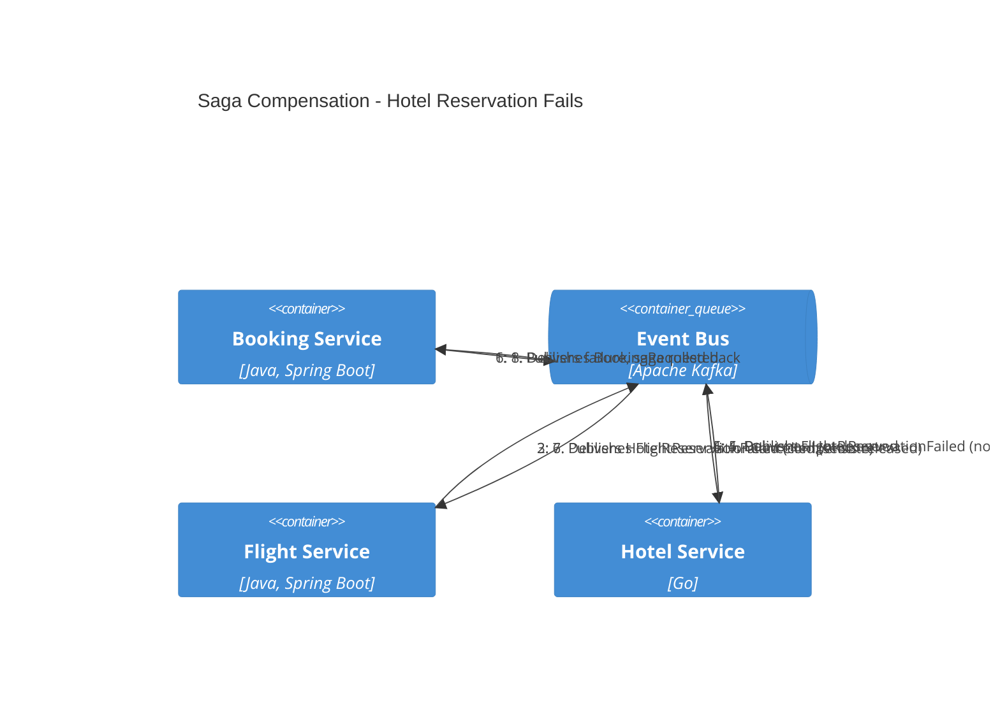

### Key Characteristics

- **No distributed transactions:** Each service manages its own local transaction
- **Event choreography:** Services react to events and emit their own events
- **Compensating actions:** When a step fails, previous steps are undone via compensation events
- **Saga state tracking:** The Booking Service maintains the saga state machine
- **Eventually consistent:** The system reaches consistency through the completion of all saga steps
- **Idempotency required:** Every event handler must be idempotent to handle retries safely

---

## Pattern Selection Guide

| Pattern | Best For | Trade-offs |
|---------|----------|------------|
| **Microservices** | Large teams, complex domains, independent scaling | Operational complexity, distributed data management |
| **Event-Driven** | Real-time processing, high throughput, loose coupling | Event ordering, eventual consistency, debugging difficulty |
| **API Gateway** | Multiple client types, centralized security, rate limiting | Single point of failure, potential bottleneck |
| **Database per Service** | Independent deployments, polyglot persistence | Cross-service queries are hard, data duplication |
| **CQRS/Event Sourcing** | High-read/low-write ratios, audit requirements, complex domains | Increased complexity, eventual consistency in reads |
| **Multi-Region** | Global user base, low latency, regulatory compliance | Data replication lag, operational cost, conflict resolution |
| **CI/CD Pipeline** | Frequent releases, quality gates, compliance auditing | Pipeline maintenance, flaky tests, long feedback loops |
| **Cross-Cutting Concerns** | Platform teams, consistent observability, security | Infrastructure overhead, configuration complexity |
| **BFF** | Multiple client types with different needs | More services to maintain, potential code duplication |
| **Saga/Choreography** | Distributed transactions, multi-service workflows | Complex failure handling, debugging difficulty |
