# Mermaid C4 Syntax Reference

Complete reference for creating C4 architecture diagrams using Mermaid's C4 syntax.

---

## Table of Contents

1. [C4Context Diagram](#c4context-diagram)
2. [C4Container Diagram](#c4container-diagram)
3. [C4Component Diagram](#c4component-diagram)
4. [C4Deployment Diagram](#c4deployment-diagram)
5. [C4Dynamic Diagram](#c4dynamic-diagram)
6. [Complete Keyword Reference](#complete-keyword-reference)
7. [Relationships](#relationships)
8. [Boundaries](#boundaries)
9. [Styling and Theming](#styling-and-theming)
10. [Full Examples](#full-examples)

---

## C4Context Diagram

The highest-level diagram showing the system in the context of its users and other systems.

### Diagram Declaration

```
C4Context
```

### Elements

| Keyword | Parameters | Description |
|---------|-----------|-------------|
| `Person(alias, label, ?description)` | alias, label, description | A human user of the system |
| `Person_Ext(alias, label, ?description)` | alias, label, description | An external person outside the system boundary |
| `System(alias, label, ?description)` | alias, label, description | The software system being described |
| `System_Ext(alias, label, ?description)` | alias, label, description | An external software system |
| `SystemDb(alias, label, ?description)` | alias, label, description | A system represented as a database |
| `SystemDb_Ext(alias, label, ?description)` | alias, label, description | An external system represented as a database |
| `SystemQueue(alias, label, ?description)` | alias, label, description | A system represented as a message queue |
| `SystemQueue_Ext(alias, label, ?description)` | alias, label, description | An external system represented as a message queue |

### Example

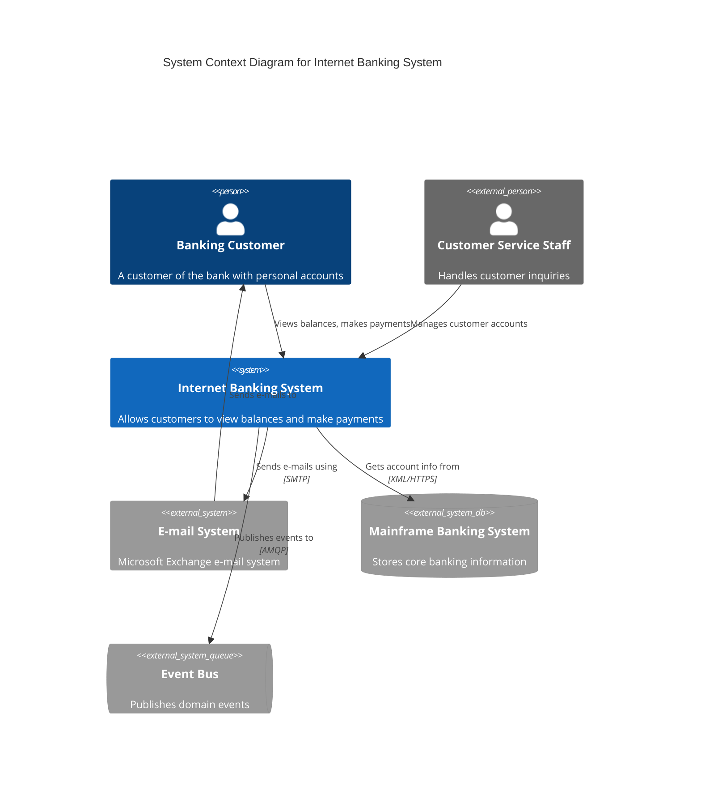

---

## C4Container Diagram

Zooms into a single system to show the high-level containers (applications, data stores, etc.).

### Diagram Declaration

```
C4Container
```

### Elements

| Keyword | Parameters | Description |
|---------|-----------|-------------|
| `Container(alias, label, ?technology, ?description)` | alias, label, tech, description | An application or data store within the system |
| `Container_Ext(alias, label, ?technology, ?description)` | alias, label, tech, description | An external container |
| `ContainerDb(alias, label, ?technology, ?description)` | alias, label, tech, description | A database container |
| `ContainerDb_Ext(alias, label, ?technology, ?description)` | alias, label, tech, description | An external database container |
| `ContainerQueue(alias, label, ?technology, ?description)` | alias, label, tech, description | A message queue container |
| `ContainerQueue_Ext(alias, label, ?technology, ?description)` | alias, label, tech, description | An external message queue container |

### Example

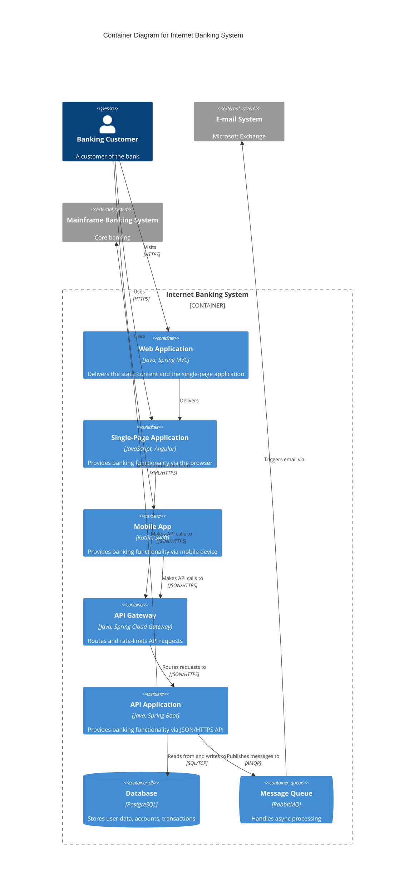

---

## C4Component Diagram

Zooms into a single container to show the components (modules, classes, services) inside it.

### Diagram Declaration

```
C4Component
```

### Elements

| Keyword | Parameters | Description |
|---------|-----------|-------------|
| `Component(alias, label, ?technology, ?description)` | alias, label, tech, description | A component within a container |
| `Component_Ext(alias, label, ?technology, ?description)` | alias, label, tech, description | An external component |
| `ComponentDb(alias, label, ?technology, ?description)` | alias, label, tech, description | A component represented as a database |
| `ComponentDb_Ext(alias, label, ?technology, ?description)` | alias, label, tech, description | An external database component |
| `ComponentQueue(alias, label, ?technology, ?description)` | alias, label, tech, description | A component represented as a message queue |
| `ComponentQueue_Ext(alias, label, ?technology, ?description)` | alias, label, tech, description | An external message queue component |

### Example

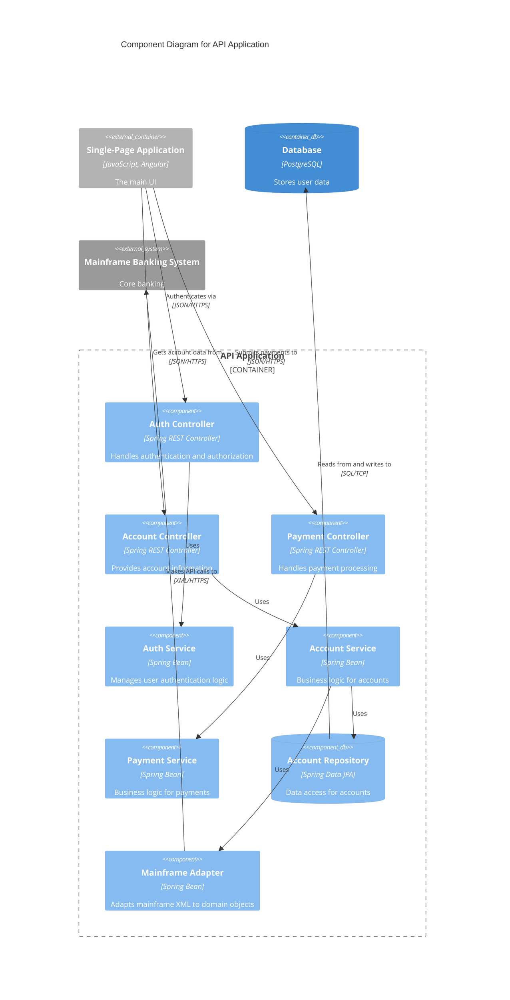

---

## C4Deployment Diagram

Shows how containers are mapped to infrastructure (servers, cloud services, containers).

### Diagram Declaration

```
C4Deployment
```

### Elements

| Keyword | Parameters | Description |
|---------|-----------|-------------|
| `Deployment_Node(alias, label, ?type, ?description)` | alias, label, type, description | An infrastructure node (server, VM, container runtime, etc.) |
| `Node(alias, label, ?type, ?description)` | alias, label, type, description | Alias for Deployment_Node |
| `Node_L(alias, label, ?type, ?description)` | alias, label, type, description | Left-aligned node |
| `Node_R(alias, label, ?type, ?description)` | alias, label, type, description | Right-aligned node |

Deployment diagrams also use Container elements (`Container`, `ContainerDb`, `ContainerQueue`) placed inside `Deployment_Node` blocks to show what runs where.

### Example

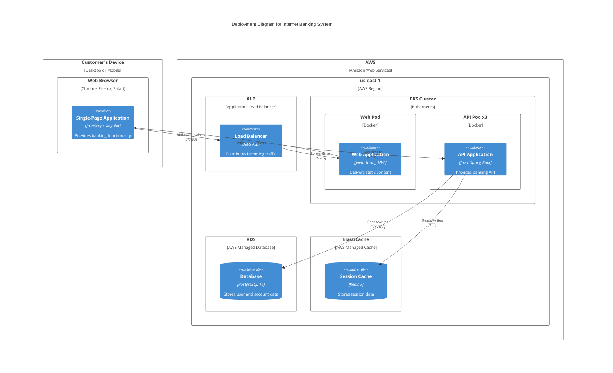

---

## C4Dynamic Diagram

Shows how elements interact at runtime with numbered, ordered relationships.

### Diagram Declaration

```
C4Dynamic
```

### Relationships in Dynamic Diagrams

Dynamic diagrams use the same elements as other C4 diagrams but relationships are rendered with sequence numbers to show the order of interactions.

| Keyword | Parameters | Description |
|---------|-----------|-------------|
| `Rel(from, to, label, ?technology)` | from, to, label, tech | A numbered relationship (auto-increments) |

### Example

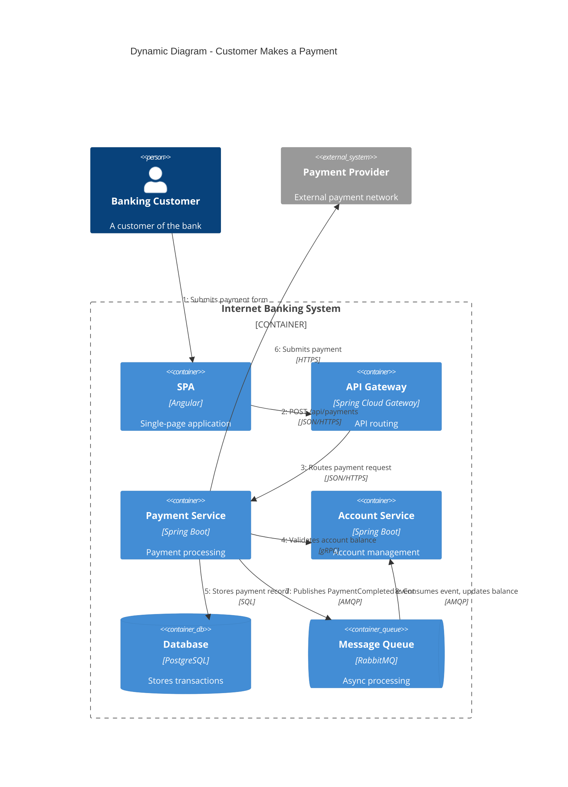

---

## Complete Keyword Reference

### Diagram Types

| Keyword | Description |
|---------|-------------|
| `C4Context` | Level 1: System Context diagram |
| `C4Container` | Level 2: Container diagram |
| `C4Component` | Level 3: Component diagram |
| `C4Deployment` | Deployment diagram |
| `C4Dynamic` | Dynamic/runtime interaction diagram |

### Person Elements

| Keyword | Parameters | Description |
|---------|-----------|-------------|
| `Person(alias, label, ?descr)` | alias, label, description | Internal person/user |
| `Person_Ext(alias, label, ?descr)` | alias, label, description | External person/user |

### System Elements

| Keyword | Parameters | Description |
|---------|-----------|-------------|
| `System(alias, label, ?descr)` | alias, label, description | Internal software system |
| `System_Ext(alias, label, ?descr)` | alias, label, description | External software system |
| `SystemDb(alias, label, ?descr)` | alias, label, description | Internal system as database |
| `SystemDb_Ext(alias, label, ?descr)` | alias, label, description | External system as database |
| `SystemQueue(alias, label, ?descr)` | alias, label, description | Internal system as queue |
| `SystemQueue_Ext(alias, label, ?descr)` | alias, label, description | External system as queue |

### Container Elements

| Keyword | Parameters | Description |
|---------|-----------|-------------|
| `Container(alias, label, ?techn, ?descr)` | alias, label, technology, description | Application, service, or data store |
| `Container_Ext(alias, label, ?techn, ?descr)` | alias, label, technology, description | External container |
| `ContainerDb(alias, label, ?techn, ?descr)` | alias, label, technology, description | Database container |
| `ContainerDb_Ext(alias, label, ?techn, ?descr)` | alias, label, technology, description | External database container |
| `ContainerQueue(alias, label, ?techn, ?descr)` | alias, label, technology, description | Message queue container |
| `ContainerQueue_Ext(alias, label, ?techn, ?descr)` | alias, label, technology, description | External message queue container |

### Component Elements

| Keyword | Parameters | Description |
|---------|-----------|-------------|
| `Component(alias, label, ?techn, ?descr)` | alias, label, technology, description | Component within a container |
| `Component_Ext(alias, label, ?techn, ?descr)` | alias, label, technology, description | External component |
| `ComponentDb(alias, label, ?techn, ?descr)` | alias, label, technology, description | Database component |
| `ComponentDb_Ext(alias, label, ?techn, ?descr)` | alias, label, technology, description | External database component |
| `ComponentQueue(alias, label, ?techn, ?descr)` | alias, label, technology, description | Message queue component |
| `ComponentQueue_Ext(alias, label, ?techn, ?descr)` | alias, label, technology, description | External message queue component |

### Deployment Elements

| Keyword | Parameters | Description |
|---------|-----------|-------------|
| `Deployment_Node(alias, label, ?type, ?descr)` | alias, label, type, description | Infrastructure node |
| `Node(alias, label, ?type, ?descr)` | alias, label, type, description | Alias for Deployment_Node |
| `Node_L(alias, label, ?type, ?descr)` | alias, label, type, description | Left-aligned deployment node |
| `Node_R(alias, label, ?type, ?descr)` | alias, label, type, description | Right-aligned deployment node |

### Boundaries

| Keyword | Parameters | Description |
|---------|-----------|-------------|
| `Boundary(alias, label, ?type)` | alias, label, type | Generic grouping boundary |
| `Enterprise_Boundary(alias, label)` | alias, label | Enterprise-level boundary |
| `System_Boundary(alias, label)` | alias, label | System-level boundary |
| `Container_Boundary(alias, label)` | alias, label | Container-level boundary |

All boundaries use block syntax with curly braces:
```
Boundary(alias, "Label") {
    ...elements...
}
```

---

## Relationships

### Relationship Keywords

| Keyword | Parameters | Description |
|---------|-----------|-------------|
| `Rel(from, to, label, ?techn)` | from alias, to alias, label, technology | Generic relationship |
| `Rel_U(from, to, label, ?techn)` | from, to, label, technology | Relationship with upward direction hint |
| `Rel_D(from, to, label, ?techn)` | from, to, label, technology | Relationship with downward direction hint |
| `Rel_L(from, to, label, ?techn)` | from, to, label, technology | Relationship with leftward direction hint |
| `Rel_R(from, to, label, ?techn)` | from, to, label, technology | Relationship with rightward direction hint |
| `Rel_Back(from, to, label, ?techn)` | from, to, label, technology | Return/callback relationship |
| `BiRel(from, to, label, ?techn)` | from, to, label, technology | Bidirectional relationship |

### Direction Aliases

| Keyword | Alias For | Direction |
|---------|-----------|-----------|
| `Rel_Up` | `Rel_U` | Upward |
| `Rel_Down` | `Rel_D` | Downward |
| `Rel_Left` | `Rel_L` | Leftward |
| `Rel_Right` | `Rel_R` | Rightward |

### Relationship Examples

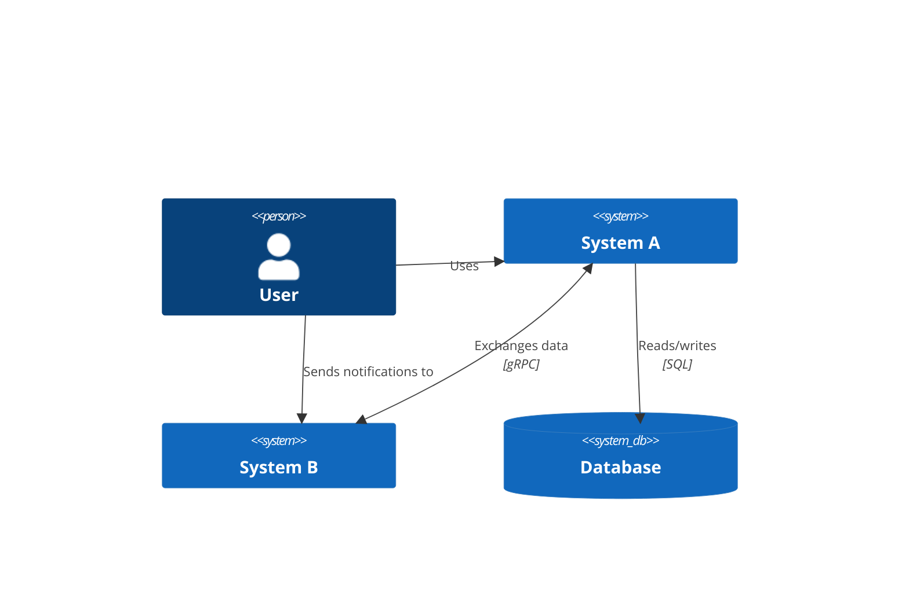

---

## Boundaries

Boundaries group related elements together visually. They use block syntax with curly braces.

### Boundary Types

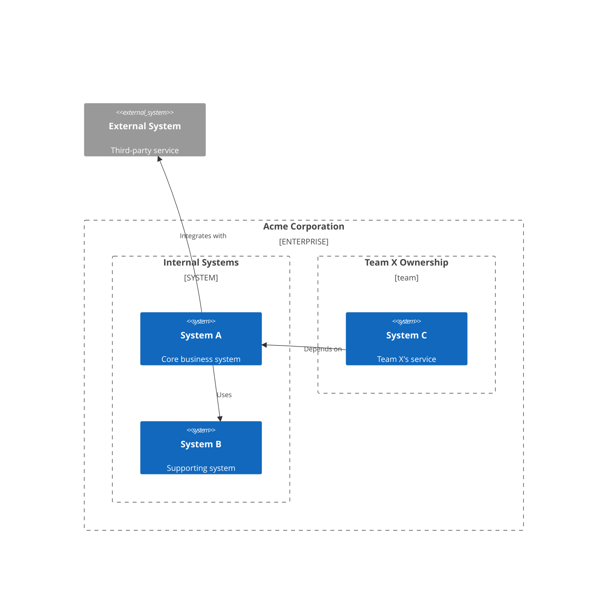

### Nesting Rules

- Boundaries can be nested inside other boundaries.
- Elements can only appear inside one boundary.
- Relationships can cross boundary lines.
- Keep nesting to a maximum of 3 levels for readability.

---

## Styling and Theming

### Title

```
title My Diagram Title
```

Place `title` immediately after the diagram type declaration.

### UpdateElementStyle

Customize the appearance of individual elements.

```
UpdateElementStyle(alias, $bgColor="color", $fontColor="color", $borderColor="color", $shadowing="true/false", $shape="shape")
```

| Parameter | Values | Description |
|-----------|--------|-------------|
| `$bgColor` | Hex color (e.g., `#438DD5`) | Background color |
| `$fontColor` | Hex color (e.g., `#FFFFFF`) | Text color |
| `$borderColor` | Hex color (e.g., `#2E6295`) | Border color |
| `$shadowing` | `"true"` or `"false"` | Whether to show shadow |
| `$shape` | `RoundedBoxShape`, `EightSidedShape`, `HexagonShape` | Element shape |
| `$sprite` | Sprite name | Icon/sprite to display |
| `$legendSprite` | Sprite name | Icon for legend |

### UpdateRelStyle

Customize the appearance of relationships.

```
UpdateRelStyle(from, to, $textColor="color", $lineColor="color", $offsetX="num", $offsetY="num")
```

| Parameter | Values | Description |
|-----------|--------|-------------|
| `$textColor` | Hex color | Color of the label text |
| `$lineColor` | Hex color | Color of the relationship line |
| `$offsetX` | Number | Horizontal offset for the label |
| `$offsetY` | Number | Vertical offset for the label |

### UpdateLayoutConfig

Configure the overall diagram layout.

```
UpdateLayoutConfig($c4ShapeInRow="num", $c4BoundaryInRow="num")
```

| Parameter | Values | Description |
|-----------|--------|-------------|
| `$c4ShapeInRow` | Number (default: 4) | Max elements per row |
| `$c4BoundaryInRow` | Number (default: 2) | Max boundaries per row |

### Styling Example

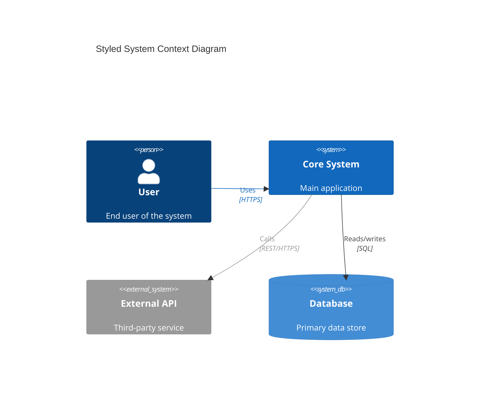

---

## Full Examples

### E-Commerce Platform - Context Diagram

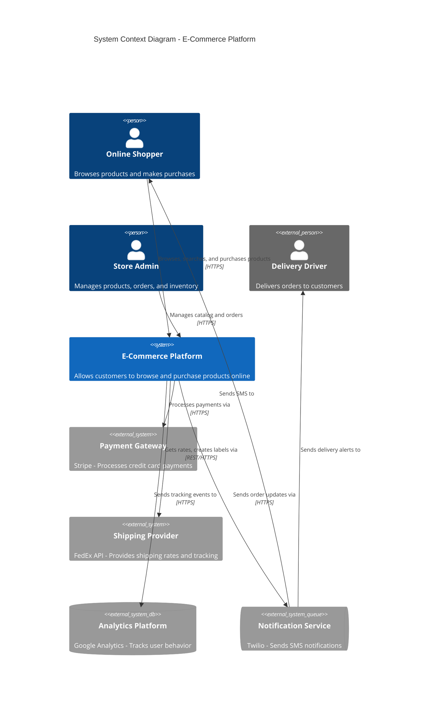

### E-Commerce Platform - Container Diagram

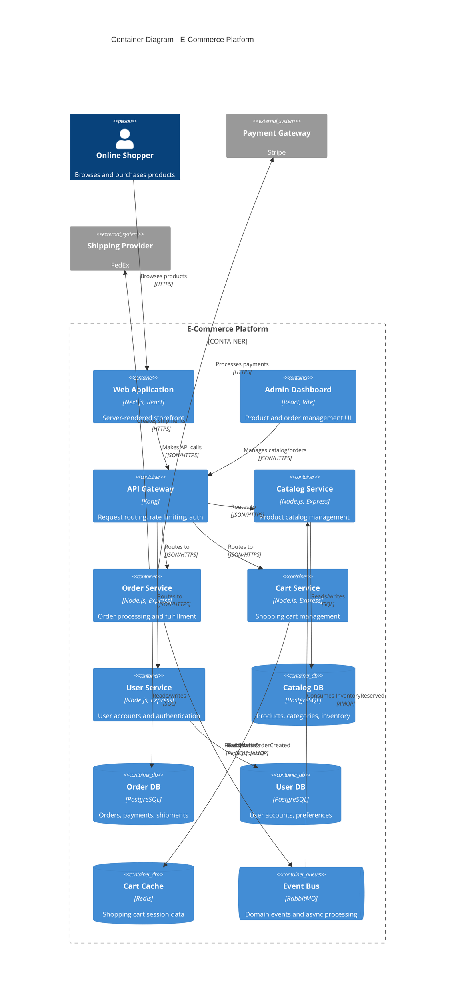

### SaaS Platform - Deployment Diagram

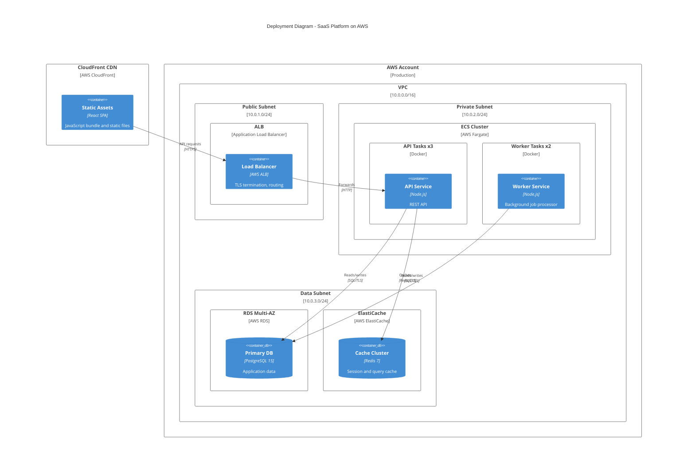

---

## Parameter Rules

1. **alias** - Must be a valid identifier (letters, numbers, underscores). No spaces or special characters. Used to reference the element in relationships.
2. **label** - Human-readable name displayed on the diagram. Enclosed in double quotes.
3. **technology** - Optional. The technology stack. Enclosed in double quotes. Only available on Container and Component elements.
4. **description** - Optional. A brief description of the element's purpose. Enclosed in double quotes.
5. Parameters prefixed with `?` in the reference tables are optional.
6. All string parameters must be enclosed in double quotes.
7. Commas separate parameters within the parentheses.

## Tips

- Always declare the diagram type first (`C4Context`, `C4Container`, etc.).
- Place `title` on the line immediately after the diagram type.
- Define all elements before defining relationships.
- Use `_Ext` suffix variants for elements outside the system boundary.
- Use descriptive relationship labels that explain *what* data flows, not just "calls" or "uses".
- Include the technology/protocol in relationship labels when it adds clarity.
- Keep diagrams focused on one level of abstraction at a time.
- Use boundaries to group logically related elements.
