# Common C4 Diagramming Mistakes and Fixes

A catalog of frequently encountered mistakes when creating C4 architecture diagrams, each with a "Bad" example demonstrating the problem and a "Good" example showing the correct approach.

---

## Table of Contents

1. [Wrong Abstraction Level](#1-wrong-abstraction-level)
2. [Missing or Unclear Relationships](#2-missing-or-unclear-relationships)
3. [Too Many Elements in One Diagram](#3-too-many-elements-in-one-diagram)
4. [Missing External Systems](#4-missing-external-systems)
5. [Inconsistent Naming Conventions](#5-inconsistent-naming-conventions)
6. [Technology Labels Too Specific or Too Vague](#6-technology-labels-too-specific-or-too-vague)
7. [Missing Deployment Context](#7-missing-deployment-context)
8. [Unlabeled or Vague Relationships](#8-unlabeled-or-vague-relationships)
9. [Boundaries Used Incorrectly](#9-boundaries-used-incorrectly)
10. [Anti-patterns in C4 Modeling](#10-anti-patterns-in-c4-modeling)

---

## 1. Wrong Abstraction Level

**Problem:** Mixing elements from different C4 levels in a single diagram. For example, showing both high-level systems and low-level components in a Context diagram, or including deployment nodes in a Container diagram.

### Bad Example

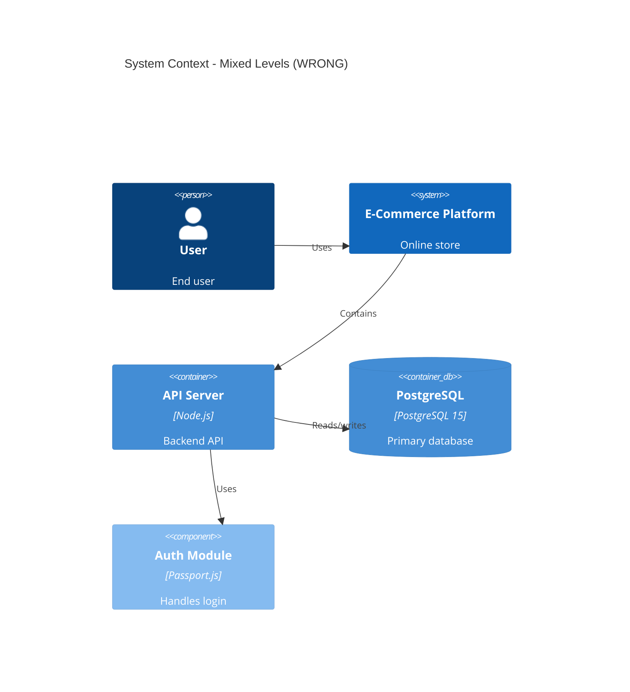
```mermaid
C4Context
    title System Context - Mixed Levels (WRONG)

    Person(user, "User", "End user")

    %% Context-level element (correct for this level)
    System(platform, "E-Commerce Platform", "Online store")

    %% Container-level elements (WRONG - too detailed for Context)
    Container(api, "API Server", "Node.js", "Backend API")
    ContainerDb(db, "PostgreSQL", "PostgreSQL 15", "Primary database")
    Component(authModule, "Auth Module", "Passport.js", "Handles login")

    Rel(user, platform, "Uses")
    Rel(platform, api, "Contains")
    Rel(api, db, "Reads/writes")
    Rel(api, authModule, "Uses")
```

**What is wrong:** The Context diagram includes Container elements (`api`, `db`) and a Component element (`authModule`). A Context diagram should only contain Systems and Persons.

### Good Example

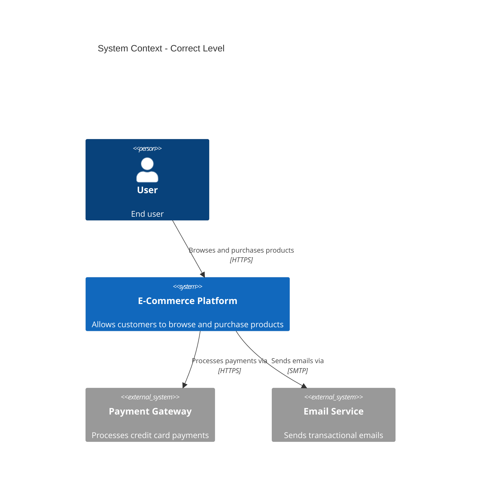
```mermaid
C4Context
    title System Context - Correct Level

    Person(user, "User", "End user")
    System(platform, "E-Commerce Platform", "Allows customers to browse and purchase products")
    System_Ext(paymentGateway, "Payment Gateway", "Processes credit card payments")
    System_Ext(emailService, "Email Service", "Sends transactional emails")

    Rel(user, platform, "Browses and purchases products", "HTTPS")
    Rel(platform, paymentGateway, "Processes payments via", "HTTPS")
    Rel(platform, emailService, "Sends emails via", "SMTP")
```

**Rule:** Each diagram should contain elements from exactly one abstraction level. Use Context diagrams for Systems, Container diagrams for Containers, and Component diagrams for Components.

---

## 2. Missing or Unclear Relationships

**Problem:** Elements exist on the diagram but have no relationships connecting them, or critical data flows between systems are omitted. This leaves viewers guessing how elements interact.

### Bad Example

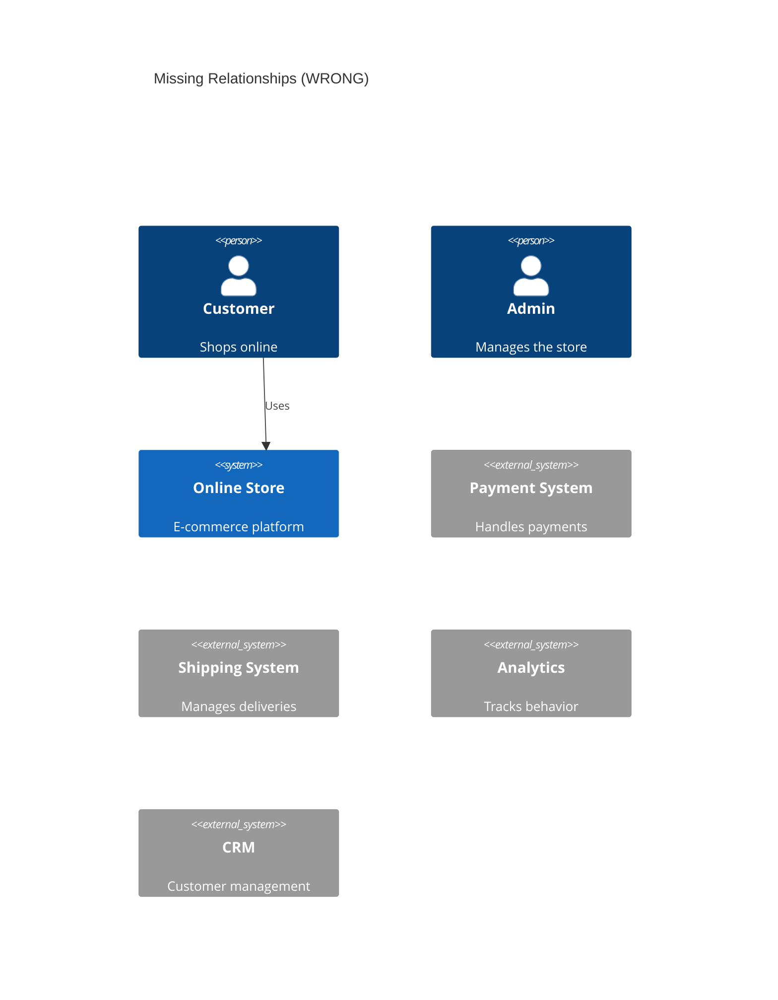
```mermaid
C4Context
    title Missing Relationships (WRONG)

    Person(customer, "Customer", "Shops online")
    Person(admin, "Admin", "Manages the store")
    System(store, "Online Store", "E-commerce platform")
    System_Ext(payment, "Payment System", "Handles payments")
    System_Ext(shipping, "Shipping System", "Manages deliveries")
    System_Ext(analytics, "Analytics", "Tracks behavior")
    System_Ext(crm, "CRM", "Customer management")

    %% Only one relationship defined - what about the rest?
    Rel(customer, store, "Uses")
```

**What is wrong:** The Admin, Payment System, Shipping System, Analytics, and CRM all float disconnected. The viewer cannot tell how data flows between them.

### Good Example

```mermaid
C4Context
    title Complete Relationships

    Person(customer, "Customer", "Shops online")
    Person(admin, "Admin", "Manages the store")
    System(store, "Online Store", "E-commerce platform")
    System_Ext(payment, "Payment System", "Handles payments")
    System_Ext(shipping, "Shipping System", "Manages deliveries")
    System_Ext(analytics, "Analytics", "Tracks behavior")
    System_Ext(crm, "CRM", "Customer management")

    Rel(customer, store, "Browses products and places orders", "HTTPS")
    Rel(admin, store, "Manages products and fulfills orders", "HTTPS")
    Rel(store, payment, "Processes payments via", "REST/HTTPS")
    Rel(store, shipping, "Creates shipments and tracks deliveries via", "REST/HTTPS")
    Rel(store, analytics, "Sends user behavior events to", "HTTPS")
    Rel(store, crm, "Syncs customer data with", "REST/HTTPS")
    Rel(shipping, customer, "Sends delivery notifications to", "SMS/Email")
```

**Rule:** Every element on the diagram must have at least one relationship. If an element has no connections, either add the missing relationships or remove the element.

---

## 3. Too Many Elements in One Diagram

**Problem:** Cramming too many elements into a single diagram makes it unreadable, difficult to maintain, and defeats the purpose of clear communication.

### Bad Example

A single Container diagram with 25+ containers, 15+ databases, and 40+ relationships all in one view. The diagram becomes a tangled mess of lines that no one can follow.

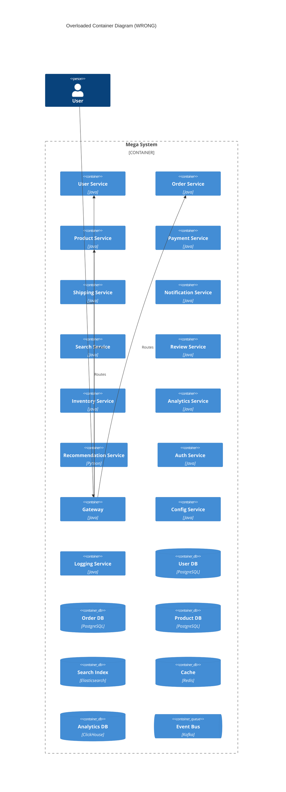
```mermaid
C4Container
    title Overloaded Container Diagram (WRONG)

    Person(user, "User")

    Container_Boundary(system, "Mega System") {
        Container(svc1, "User Service", "Java")
        Container(svc2, "Order Service", "Java")
        Container(svc3, "Product Service", "Java")
        Container(svc4, "Payment Service", "Java")
        Container(svc5, "Shipping Service", "Java")
        Container(svc6, "Notification Service", "Java")
        Container(svc7, "Search Service", "Java")
        Container(svc8, "Review Service", "Java")
        Container(svc9, "Inventory Service", "Java")
        Container(svc10, "Analytics Service", "Java")
        Container(svc11, "Recommendation Service", "Python")
        Container(svc12, "Auth Service", "Java")
        Container(svc13, "Gateway", "Java")
        Container(svc14, "Config Service", "Java")
        Container(svc15, "Logging Service", "Java")
        ContainerDb(db1, "User DB", "PostgreSQL")
        ContainerDb(db2, "Order DB", "PostgreSQL")
        ContainerDb(db3, "Product DB", "PostgreSQL")
        ContainerDb(db4, "Search Index", "Elasticsearch")
        ContainerDb(db5, "Cache", "Redis")
        ContainerDb(db6, "Analytics DB", "ClickHouse")
        ContainerQueue(q1, "Event Bus", "Kafka")
    }

    %% Dozens of criss-crossing relationships...
    Rel(user, svc13, "Uses")
    Rel(svc13, svc1, "Routes")
    Rel(svc13, svc2, "Routes")
    Rel(svc13, svc3, "Routes")
    %% ... many more
```

**What is wrong:** Over 20 elements and their relationships in a single diagram. This is unreadable at any zoom level.

### Good Example

Split the system into focused views using boundaries, or create separate diagrams for different subsystems. Aim for 10-15 elements maximum per diagram.

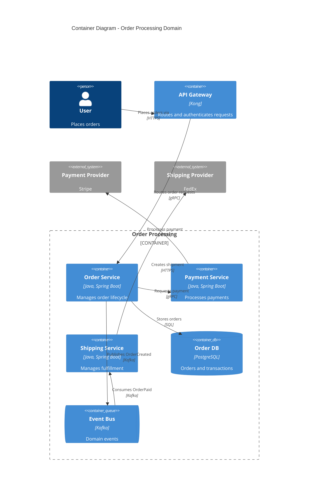
```mermaid
C4Container
    title Container Diagram - Order Processing Domain

    Person(user, "User", "Places orders")
    Container(gateway, "API Gateway", "Kong", "Routes and authenticates requests")

    Container_Boundary(orderDomain, "Order Processing") {
        Container(orderService, "Order Service", "Java, Spring Boot", "Manages order lifecycle")
        Container(paymentService, "Payment Service", "Java, Spring Boot", "Processes payments")
        Container(shippingService, "Shipping Service", "Java, Spring Boot", "Manages fulfillment")
        ContainerDb(orderDb, "Order DB", "PostgreSQL", "Orders and transactions")
        ContainerQueue(eventBus, "Event Bus", "Kafka", "Domain events")
    }

    System_Ext(paymentProvider, "Payment Provider", "Stripe")
    System_Ext(shippingProvider, "Shipping Provider", "FedEx")

    Rel(user, gateway, "Places orders via", "HTTPS")
    Rel(gateway, orderService, "Routes order requests", "gRPC")
    Rel(orderService, paymentService, "Requests payment", "gRPC")
    Rel(orderService, orderDb, "Stores orders", "SQL")
    Rel(orderService, eventBus, "Publishes OrderCreated", "Kafka")
    Rel(eventBus, shippingService, "Consumes OrderPaid", "Kafka")
    Rel(paymentService, paymentProvider, "Processes payment", "HTTPS")
    Rel(shippingService, shippingProvider, "Creates shipment", "HTTPS")
```

**Rule:** Keep diagrams to 10-15 elements maximum. If you need more, create separate diagrams for different bounded contexts or subsystems, with a high-level overview diagram linking them.

---

## 4. Missing External Systems

**Problem:** Showing only internal systems while omitting the external systems, services, and APIs that the software depends on. This hides critical dependencies and integration points.

### Bad Example

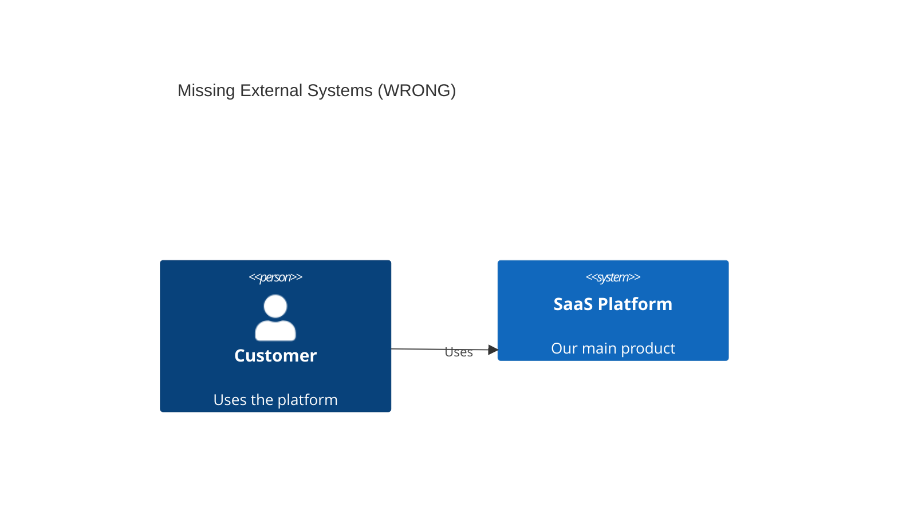
```mermaid
C4Context
    title Missing External Systems (WRONG)

    Person(user, "Customer", "Uses the platform")
    System(platform, "SaaS Platform", "Our main product")

    Rel(user, platform, "Uses")
    %% Where does authentication happen? What about payments?
    %% What about the CDN, email service, monitoring?
```

**What is wrong:** The platform clearly depends on external services (auth providers, email, CDN, payment processors) but none are shown. Stakeholders cannot see the full dependency picture.

### Good Example

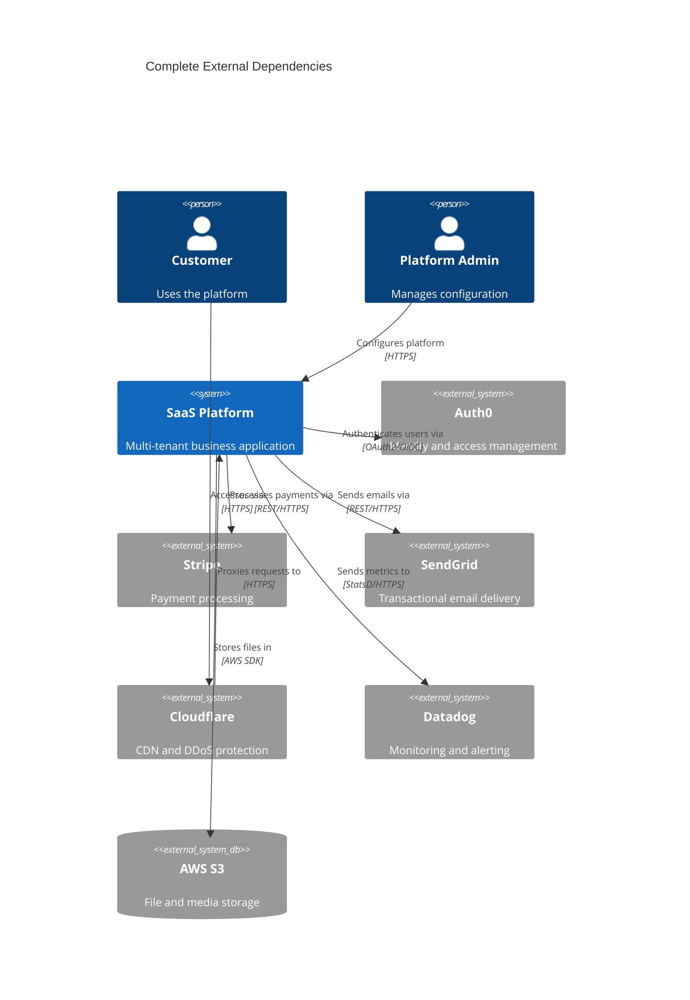
```mermaid
C4Context
    title Complete External Dependencies

    Person(user, "Customer", "Uses the platform")
    Person(admin, "Platform Admin", "Manages configuration")

    System(platform, "SaaS Platform", "Multi-tenant business application")

    System_Ext(auth0, "Auth0", "Identity and access management")
    System_Ext(stripe, "Stripe", "Payment processing")
    System_Ext(sendgrid, "SendGrid", "Transactional email delivery")
    System_Ext(cloudflare, "Cloudflare", "CDN and DDoS protection")
    System_Ext(datadog, "Datadog", "Monitoring and alerting")
    SystemDb_Ext(s3, "AWS S3", "File and media storage")

    Rel(user, cloudflare, "Accesses via", "HTTPS")
    Rel(cloudflare, platform, "Proxies requests to", "HTTPS")
    Rel(platform, auth0, "Authenticates users via", "OAuth2/OIDC")
    Rel(platform, stripe, "Processes payments via", "REST/HTTPS")
    Rel(platform, sendgrid, "Sends emails via", "REST/HTTPS")
    Rel(platform, s3, "Stores files in", "AWS SDK")
    Rel(platform, datadog, "Sends metrics to", "StatsD/HTTPS")
    Rel(admin, platform, "Configures platform", "HTTPS")
```

**Rule:** Always identify and include external systems: authentication providers, payment gateways, email services, CDNs, monitoring tools, cloud storage, third-party APIs, and any other service your system depends on.

---

## 5. Inconsistent Naming Conventions

**Problem:** Using different naming styles, abbreviations, and capitalization across elements makes diagrams confusing and unprofessional.

### Bad Example

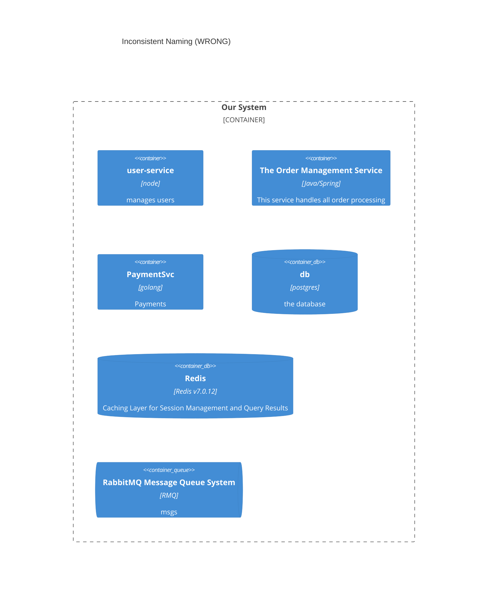
```mermaid
C4Container
    title Inconsistent Naming (WRONG)

    Container_Boundary(sys, "Our System") {
        Container(usrSvc, "user-service", "node", "manages users")
        Container(OrderSVC, "The Order Management Service", "Java/Spring", "This service handles all order processing")
        Container(pmt_service, "PaymentSvc", "golang", "Payments")
        ContainerDb(DB, "db", "postgres", "the database")
        ContainerDb(redis_cache, "Redis", "Redis v7.0.12", "Caching Layer for Session Management and Query Results")
        ContainerQueue(MQ, "RabbitMQ Message Queue System", "RMQ", "msgs")
    }
```

**What is wrong:**
- Aliases vary: `usrSvc`, `OrderSVC`, `pmt_service`, `DB`, `redis_cache`, `MQ`
- Labels vary: `user-service`, `The Order Management Service`, `PaymentSvc`, `db`
- Technology naming varies: `node`, `Java/Spring`, `golang`, `postgres`
- Description quality varies: too terse ("Payments"), too verbose, lowercase starts

### Good Example

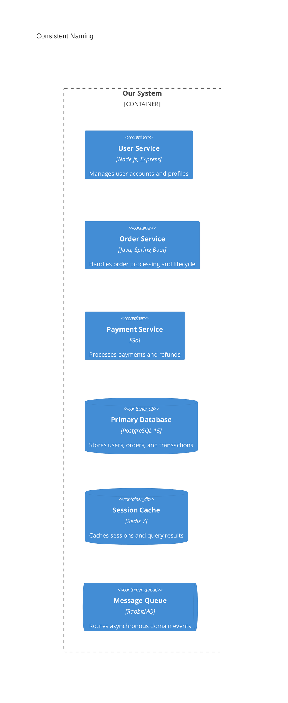
```mermaid
C4Container
    title Consistent Naming

    Container_Boundary(sys, "Our System") {
        Container(userService, "User Service", "Node.js, Express", "Manages user accounts and profiles")
        Container(orderService, "Order Service", "Java, Spring Boot", "Handles order processing and lifecycle")
        Container(paymentService, "Payment Service", "Go", "Processes payments and refunds")
        ContainerDb(primaryDb, "Primary Database", "PostgreSQL 15", "Stores users, orders, and transactions")
        ContainerDb(sessionCache, "Session Cache", "Redis 7", "Caches sessions and query results")
        ContainerQueue(messageQueue, "Message Queue", "RabbitMQ", "Routes asynchronous domain events")
    }
```

**Rule:** Establish and follow these conventions:
- **Aliases:** camelCase, descriptive (`orderService`, `primaryDb`)
- **Labels:** Title Case, 2-3 words (`Order Service`, `Primary Database`)
- **Technology:** Official product name with optional version (`PostgreSQL 15`, `Redis 7`)
- **Descriptions:** Sentence fragment starting with a verb, consistent length (`Handles order processing and lifecycle`)

---

## 6. Technology Labels Too Specific or Too Vague

**Problem:** Technology labels that are either overly specific (including every minor library and version) or too vague to be useful.

### Bad Example - Too Specific

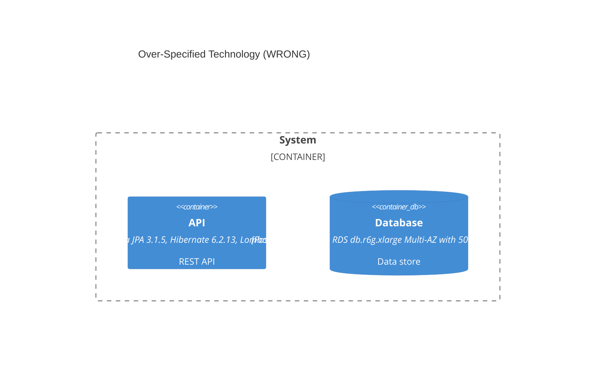
```mermaid
C4Container
    title Over-Specified Technology (WRONG)

    Container_Boundary(sys, "System") {
        Container(api, "API", "Java 17.0.6, Spring Boot 3.1.5, Spring Data JPA 3.1.5, Hibernate 6.2.13, Lombok 1.18.30, MapStruct 1.5.5, Jackson 2.15.3", "REST API")
        ContainerDb(db, "Database", "PostgreSQL 15.4 on RDS db.r6g.xlarge Multi-AZ with 500GB gp3 IOPS 3000", "Data store")
    }
```

### Bad Example - Too Vague

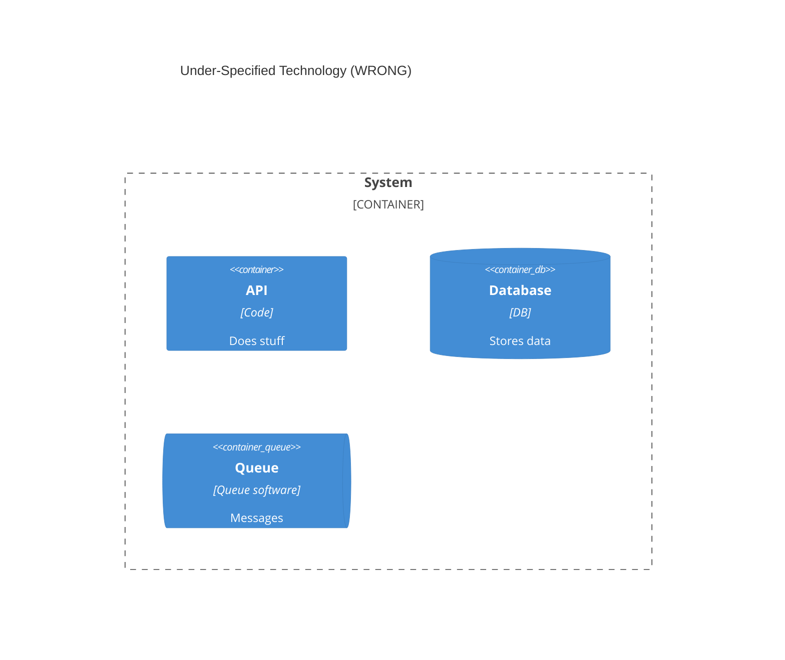
```mermaid
C4Container
    title Under-Specified Technology (WRONG)

    Container_Boundary(sys, "System") {
        Container(api, "API", "Code", "Does stuff")
        ContainerDb(db, "Database", "DB", "Stores data")
        ContainerQueue(queue, "Queue", "Queue software", "Messages")
    }
```

### Good Example

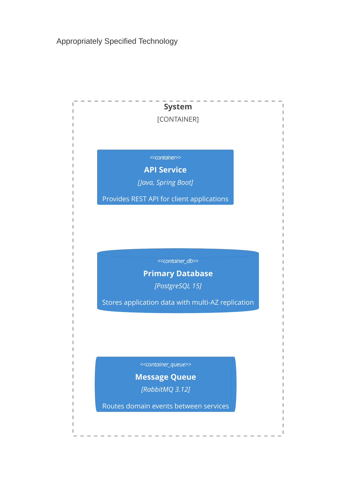
```mermaid
C4Container
    title Appropriately Specified Technology

    Container_Boundary(sys, "System") {
        Container(api, "API Service", "Java, Spring Boot", "Provides REST API for client applications")
        ContainerDb(db, "Primary Database", "PostgreSQL 15", "Stores application data with multi-AZ replication")
        ContainerQueue(queue, "Message Queue", "RabbitMQ 3.12", "Routes domain events between services")
    }
```

**Rule:** Include the primary language/framework and the product name with major version. Omit minor versions, library dependencies, infrastructure sizing, and configuration details. Those belong in deployment documentation, not architecture diagrams.

**Technology label guidelines:**
- Languages: `Java`, `Python 3.12`, `TypeScript`
- Frameworks: `Spring Boot`, `Express`, `Django`
- Databases: `PostgreSQL 15`, `MongoDB 7`, `Redis 7`
- Queues: `RabbitMQ 3.12`, `Apache Kafka 3.6`
- Combine language and framework: `Java, Spring Boot` or `TypeScript, Next.js`

---

## 7. Missing Deployment Context

**Problem:** Container diagrams that show what the software looks like but never show where or how it runs. Without deployment diagrams, teams lack visibility into infrastructure, scaling, and operational concerns.

### Bad Example

Only having a Container diagram with no deployment context:

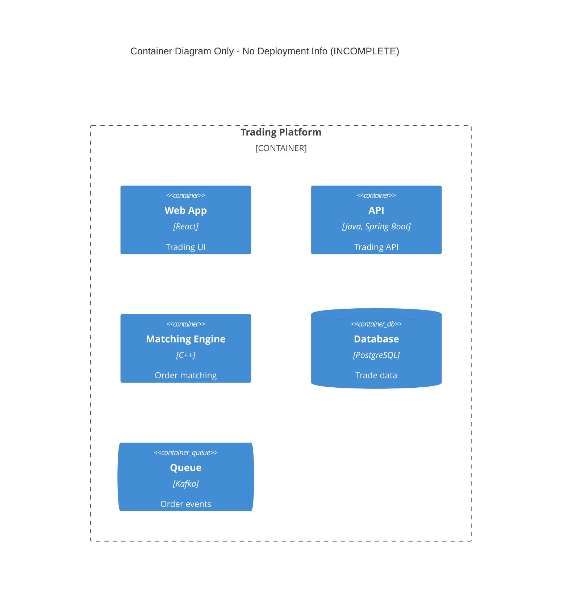
```mermaid
C4Container
    title Container Diagram Only - No Deployment Info (INCOMPLETE)

    Container_Boundary(sys, "Trading Platform") {
        Container(web, "Web App", "React", "Trading UI")
        Container(api, "API", "Java, Spring Boot", "Trading API")
        Container(matchEngine, "Matching Engine", "C++", "Order matching")
        ContainerDb(db, "Database", "PostgreSQL", "Trade data")
        ContainerQueue(queue, "Queue", "Kafka", "Order events")
    }
    %% Where does this run? How many instances? What about failover?
```

### Good Example

Complement the Container diagram with a Deployment diagram:

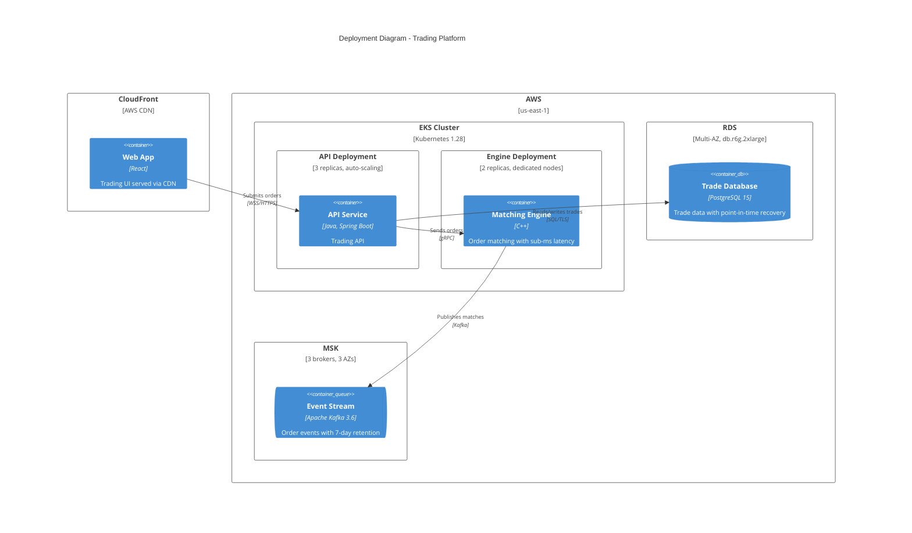
```mermaid
C4Deployment
    title Deployment Diagram - Trading Platform

    Deployment_Node(cdn, "CloudFront", "AWS CDN") {
        Container(web, "Web App", "React", "Trading UI served via CDN")
    }

    Deployment_Node(aws, "AWS", "us-east-1") {
        Deployment_Node(eks, "EKS Cluster", "Kubernetes 1.28") {
            Deployment_Node(apiDeploy, "API Deployment", "3 replicas, auto-scaling") {
                Container(api, "API Service", "Java, Spring Boot", "Trading API")
            }
            Deployment_Node(engineDeploy, "Engine Deployment", "2 replicas, dedicated nodes") {
                Container(matchEngine, "Matching Engine", "C++", "Order matching with sub-ms latency")
            }
        }
        Deployment_Node(rds, "RDS", "Multi-AZ, db.r6g.2xlarge") {
            ContainerDb(db, "Trade Database", "PostgreSQL 15", "Trade data with point-in-time recovery")
        }
        Deployment_Node(msk, "MSK", "3 brokers, 3 AZs") {
            ContainerQueue(queue, "Event Stream", "Apache Kafka 3.6", "Order events with 7-day retention")
        }
    }

    Rel(web, api, "Submits orders", "WSS/HTTPS")
    Rel(api, matchEngine, "Sends orders", "gRPC")
    Rel(matchEngine, queue, "Publishes matches", "Kafka")
    Rel(api, db, "Reads/writes trades", "SQL/TLS")
```

**Rule:** Always create deployment diagrams alongside container diagrams. They answer critical questions: How many instances? What infrastructure? How does it scale? What happens during failover?

---

## 8. Unlabeled or Vague Relationships

**Problem:** Relationships that use generic labels like "uses", "calls", or "sends data" without explaining what data flows or why the interaction exists.

### Bad Example

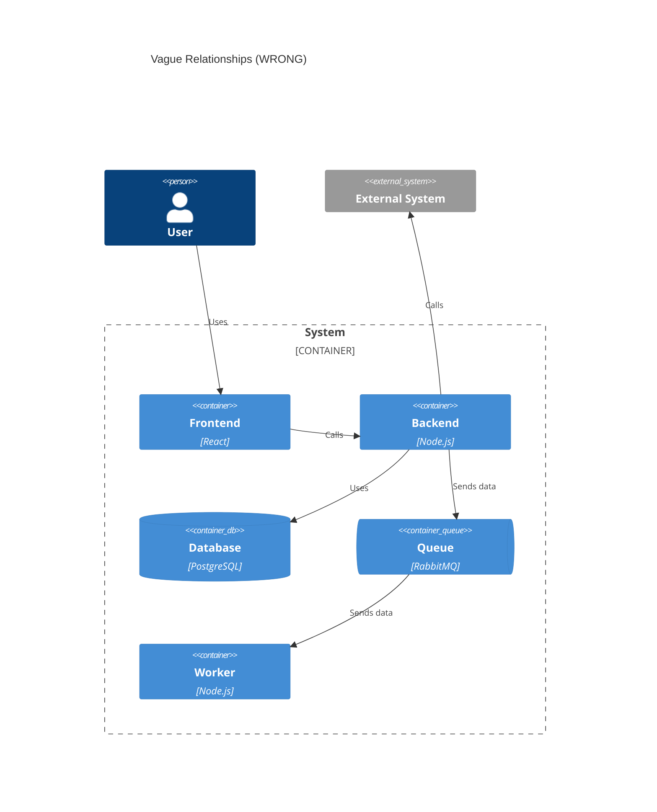
```mermaid
C4Container
    title Vague Relationships (WRONG)

    Person(user, "User")

    Container_Boundary(sys, "System") {
        Container(frontend, "Frontend", "React")
        Container(backend, "Backend", "Node.js")
        ContainerDb(db, "Database", "PostgreSQL")
        ContainerQueue(queue, "Queue", "RabbitMQ")
        Container(worker, "Worker", "Node.js")
    }

    System_Ext(ext, "External System")

    Rel(user, frontend, "Uses")
    Rel(frontend, backend, "Calls")
    Rel(backend, db, "Uses")
    Rel(backend, queue, "Sends data")
    Rel(queue, worker, "Sends data")
    Rel(backend, ext, "Calls")
```

**What is wrong:** Every relationship says "Uses", "Calls", or "Sends data". A new team member cannot understand what data flows between elements.

### Good Example

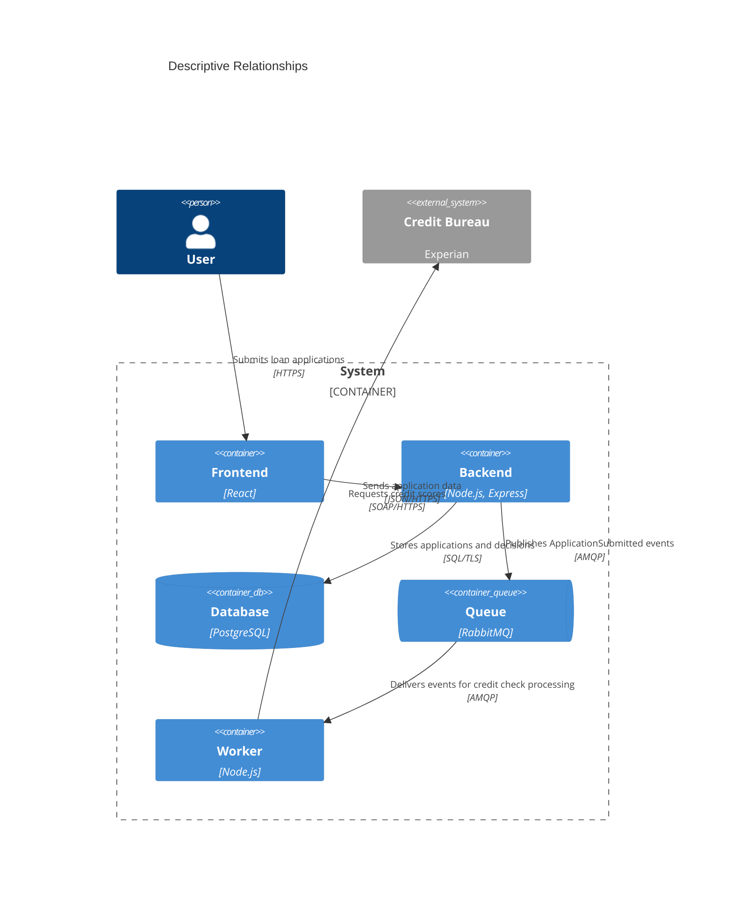
```mermaid
C4Container
    title Descriptive Relationships

    Person(user, "User")

    Container_Boundary(sys, "System") {
        Container(frontend, "Frontend", "React")
        Container(backend, "Backend", "Node.js, Express")
        ContainerDb(db, "Database", "PostgreSQL")
        ContainerQueue(queue, "Queue", "RabbitMQ")
        Container(worker, "Worker", "Node.js")
    }

    System_Ext(ext, "Credit Bureau", "Experian")

    Rel(user, frontend, "Submits loan applications", "HTTPS")
    Rel(frontend, backend, "Sends application data", "JSON/HTTPS")
    Rel(backend, db, "Stores applications and decisions", "SQL/TLS")
    Rel(backend, queue, "Publishes ApplicationSubmitted events", "AMQP")
    Rel(queue, worker, "Delivers events for credit check processing", "AMQP")
    Rel(worker, ext, "Requests credit scores", "SOAP/HTTPS")
```

**Rule:** Relationship labels should answer: "What data or command flows between these elements?" Include the protocol/technology when it adds useful context. Good labels use specific verbs: "Submits loan applications", "Publishes OrderCreated events", "Stores session data".

---

## 9. Boundaries Used Incorrectly

**Problem:** Using boundaries in ways that misrepresent the architecture -- grouping unrelated elements, nesting too deeply, or using the wrong boundary type.

### Bad Example

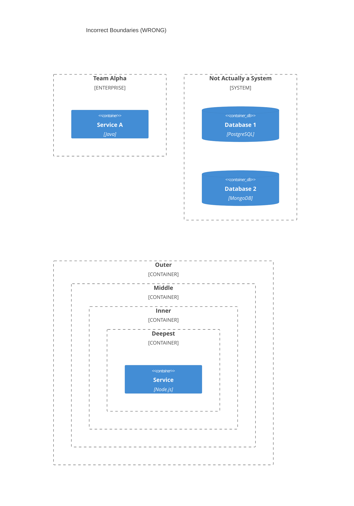
```mermaid
C4Container
    title Incorrect Boundaries (WRONG)

    %% Wrong: Using Enterprise_Boundary for a team grouping
    Enterprise_Boundary(team, "Team Alpha") {
        Container(svcA, "Service A", "Java")
    }

    %% Wrong: Mixing system and container boundaries incorrectly
    System_Boundary(wrong, "Not Actually a System") {
        ContainerDb(db1, "Database 1", "PostgreSQL")
        ContainerDb(db2, "Database 2", "MongoDB")
        %% These databases belong to different systems but are grouped together
    }

    %% Wrong: Deeply nested boundaries that add no clarity
    Container_Boundary(outer, "Outer") {
        Container_Boundary(middle, "Middle") {
            Container_Boundary(inner, "Inner") {
                Container_Boundary(deepest, "Deepest") {
                    Container(svc, "Service", "Node.js")
                }
            }
        }
    }
```

**What is wrong:**
- Enterprise boundary used for team ownership (wrong semantics)
- System boundary grouping unrelated databases from different systems
- Four levels of nesting that add no architectural information

### Good Example

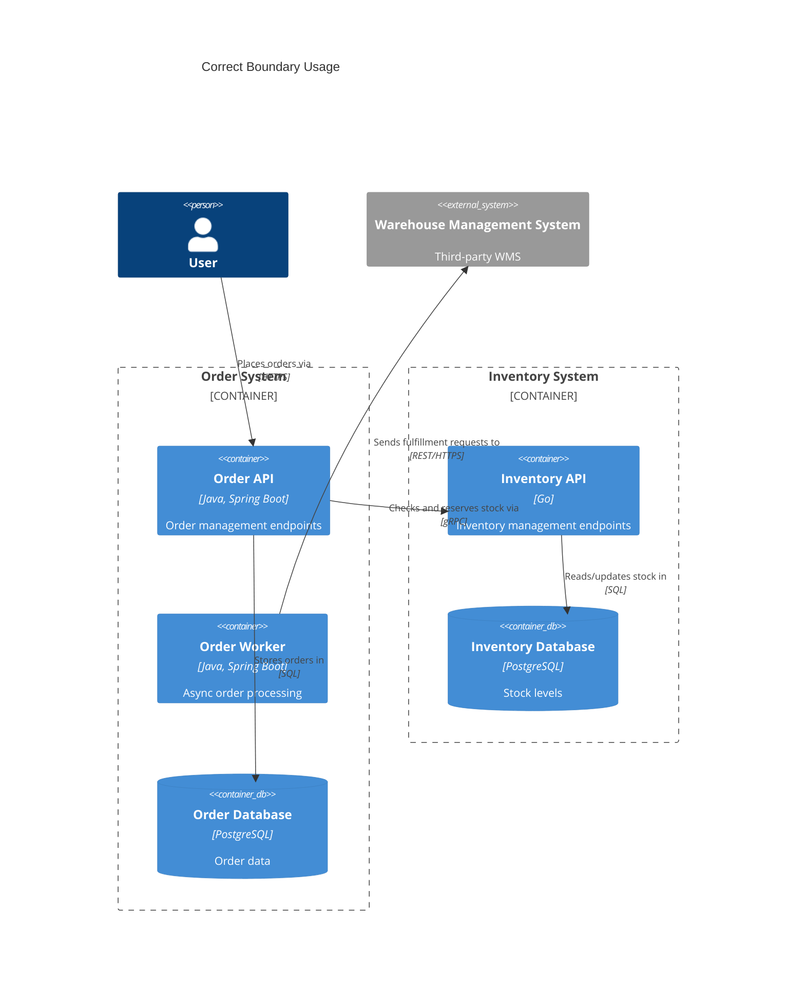
```mermaid
C4Container
    title Correct Boundary Usage

    Person(user, "User")

    Container_Boundary(orderSystem, "Order System") {
        Container(orderApi, "Order API", "Java, Spring Boot", "Order management endpoints")
        Container(orderWorker, "Order Worker", "Java, Spring Boot", "Async order processing")
        ContainerDb(orderDb, "Order Database", "PostgreSQL", "Order data")
    }

    Container_Boundary(inventorySystem, "Inventory System") {
        Container(inventoryApi, "Inventory API", "Go", "Inventory management endpoints")
        ContainerDb(inventoryDb, "Inventory Database", "PostgreSQL", "Stock levels")
    }

    System_Ext(warehouse, "Warehouse Management System", "Third-party WMS")

    Rel(user, orderApi, "Places orders via", "HTTPS")
    Rel(orderApi, orderDb, "Stores orders in", "SQL")
    Rel(orderApi, inventoryApi, "Checks and reserves stock via", "gRPC")
    Rel(inventoryApi, inventoryDb, "Reads/updates stock in", "SQL")
    Rel(orderWorker, warehouse, "Sends fulfillment requests to", "REST/HTTPS")
```

**Rule:**
- Use `Enterprise_Boundary` only for the top-level organizational boundary.
- Use `System_Boundary` to group containers that form a system.
- Use `Container_Boundary` to group components within a container.
- Use generic `Boundary` for custom groupings (e.g., by domain or deployment zone).
- Limit nesting to 2-3 levels maximum.
- Only group elements that genuinely belong together architecturally.

---

## 10. Anti-patterns in C4 Modeling

### Anti-pattern A: The God System

**Problem:** Representing the entire architecture as a single monolithic system at the Context level, hiding all internal complexity.

**Bad:**
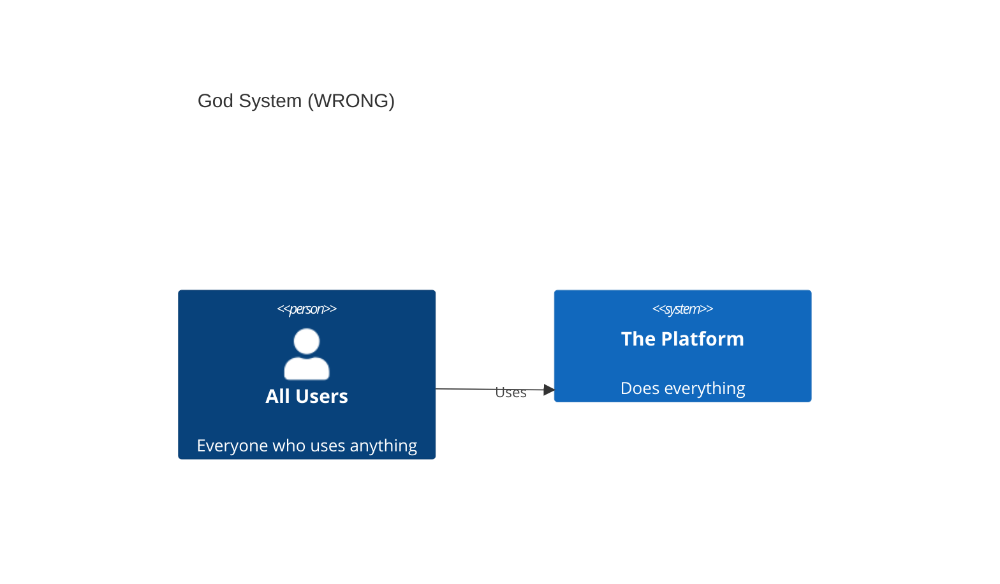
```mermaid
C4Context
    title God System (WRONG)

    Person(everyone, "All Users", "Everyone who uses anything")
    System(everything, "The Platform", "Does everything")

    Rel(everyone, everything, "Uses")
```

**Good:**
```mermaid
C4Context
    title Properly Decomposed Systems

    Person(customer, "Customer", "Purchases products")
    Person(merchant, "Merchant", "Manages store")

    System(storefront, "Storefront", "Customer-facing shopping experience")
    System(merchantPortal, "Merchant Portal", "Store and inventory management")
    System(fulfillment, "Fulfillment System", "Order processing and shipping")

    System_Ext(payment, "Payment Gateway", "Stripe")

    Rel(customer, storefront, "Browses and purchases", "HTTPS")
    Rel(merchant, merchantPortal, "Manages products and orders", "HTTPS")
    Rel(storefront, fulfillment, "Submits orders to")
    Rel(merchantPortal, fulfillment, "Manages fulfillment via")
    Rel(fulfillment, payment, "Processes payments via", "HTTPS")
```

### Anti-pattern B: The Spider Web

**Problem:** Every element connects to every other element, creating an unreadable web of lines. This usually means the diagram is at the wrong abstraction level or missing intermediary elements like an API gateway or event bus.

**Bad:**
```mermaid
C4Container
    title Spider Web (WRONG)

    Container_Boundary(sys, "System") {
        Container(a, "Service A", "Java")
        Container(b, "Service B", "Java")
        Container(c, "Service C", "Java")
        Container(d, "Service D", "Java")
    }

    Rel(a, b, "Calls")
    Rel(a, c, "Calls")
    Rel(a, d, "Calls")
    Rel(b, a, "Calls")
    Rel(b, c, "Calls")
    Rel(b, d, "Calls")
    Rel(c, a, "Calls")
    Rel(c, b, "Calls")
    Rel(c, d, "Calls")
    Rel(d, a, "Calls")
    Rel(d, b, "Calls")
    Rel(d, c, "Calls")
```

**Good:**
```mermaid
C4Container
    title Mediated Communication

    Container_Boundary(sys, "System") {
        Container(a, "Service A", "Java, Spring Boot", "Handles domain A logic")
        Container(b, "Service B", "Java, Spring Boot", "Handles domain B logic")
        Container(c, "Service C", "Java, Spring Boot", "Handles domain C logic")
        Container(d, "Service D", "Java, Spring Boot", "Handles domain D logic")
        ContainerQueue(eventBus, "Event Bus", "Apache Kafka", "Decouples services via domain events")
    }

    Rel(a, eventBus, "Publishes DomainA events", "Kafka")
    Rel(b, eventBus, "Publishes DomainB events", "Kafka")
    Rel(c, eventBus, "Publishes DomainC events", "Kafka")
    Rel(d, eventBus, "Publishes DomainD events", "Kafka")
    Rel(eventBus, a, "Delivers subscribed events", "Kafka")
    Rel(eventBus, b, "Delivers subscribed events", "Kafka")
    Rel(eventBus, c, "Delivers subscribed events", "Kafka")
    Rel(eventBus, d, "Delivers subscribed events", "Kafka")
```

### Anti-pattern C: The Copy-Paste Diagram

**Problem:** Every diagram in the set is nearly identical, just with a different title. The diagrams do not actually zoom in to provide more detail at each level.

**Bad approach:** Creating a Context, Container, and Component diagram that all show the same 5 boxes with the same relationships. The Container diagram adds no detail beyond the Context diagram.

**Good approach:** Each level should reveal new information:
- **Context:** Shows 4-6 systems and how they relate
- **Container:** Zooms into ONE system to reveal 8-12 containers (web apps, services, databases)
- **Component:** Zooms into ONE container to reveal 6-10 internal components (controllers, services, repositories)

### Anti-pattern D: Infrastructure as Architecture

**Problem:** Confusing infrastructure topology with software architecture. Drawing AWS services, Kubernetes pods, and network subnets in a Container diagram instead of a Deployment diagram.

**Bad:**
```mermaid
C4Container
    title Infrastructure Masquerading as Architecture (WRONG)

    Container_Boundary(aws, "AWS us-east-1") {
        Container(alb, "ALB", "AWS ALB", "Load balancer in public subnet")
        Container(ec2a, "EC2 Instance a", "t3.large", "Runs in AZ-a")
        Container(ec2b, "EC2 Instance b", "t3.large", "Runs in AZ-b")
        ContainerDb(rds, "RDS Instance", "db.r5.xlarge", "Multi-AZ PostgreSQL")
        Container(s3, "S3 Bucket", "Standard tier", "Static assets")
    }
```

**Good:** Use a Container diagram for software architecture and a Deployment diagram for infrastructure:

```mermaid
C4Container
    title Software Architecture

    Container_Boundary(system, "Platform") {
        Container(webApp, "Web Application", "React, Next.js", "Customer-facing UI")
        Container(apiService, "API Service", "Node.js, Express", "Business logic and REST API")
        ContainerDb(database, "Database", "PostgreSQL 15", "Application data")
        ContainerDb(fileStore, "File Storage", "AWS S3", "User uploads and static assets")
    }
```

### Anti-pattern E: The Missing Legend

**Problem:** Using custom colors, shapes, or styles without explaining what they mean. Viewers are left guessing why some boxes are blue and others are gray.

**Rule:** If you customize element styles, always include a note or legend explaining the color/shape conventions. Alternatively, rely on the standard C4 conventions where internal elements are blue and external elements are gray.

---

## Quick Reference: Mistake Checklist

Before finalizing a C4 diagram, verify:

- [ ] All elements are at the correct abstraction level for this diagram type
- [ ] Every element has at least one relationship
- [ ] The diagram has 15 or fewer elements
- [ ] All external systems and dependencies are shown
- [ ] Naming follows a consistent convention (casing, style, detail level)
- [ ] Technology labels use official names with major versions only
- [ ] Deployment diagrams exist alongside container diagrams
- [ ] Relationship labels describe what data flows, not just "uses" or "calls"
- [ ] Boundaries group architecturally related elements at appropriate nesting depth
- [ ] Each diagram in the set reveals new information at its level of detail
- [ ] Infrastructure concerns are in Deployment diagrams, not Container diagrams
- [ ] Custom styling has a clear legend or follows standard conventions
